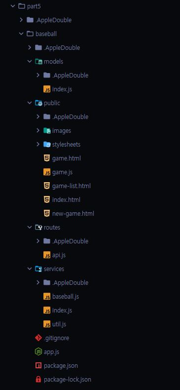

> [목차](index.md)  
## 실무 예제
- [숨김 메뉴_drawer menu 만들기](#숨김-메뉴_drawer-menu-만들기)
- [Hash URL과 함께 동작하는 탭 메뉴 만들기](#hash-url과-함께-동작하는-탭-메뉴-만들기)
- [멀티 슬라이드쇼 만들기](#멀티-슬라이드쇼-만들기)
- [간단한 텍스트 에디터 만들기](#간단한-텍스트-에디터-만들기)
- [할 일 관리 애플리케이션 만들기](#할-일-관리-애플리케이션-만들기)
- [파일 업로드 프로젝트 만들기](#파일-업로드-프로젝트-만들기)
- [베이스볼 게임 만들기](#베이스볼-게임-만들기)

<br><br>
<br><br>


# 숨김 메뉴_drawer menu 만들기
- 주로 한쪽 측면에 메뉴가 보였다 숨겨쪗다 하는 숨김 메뉴를 만들어 봅니다. 서랍을 의미하는 drawer 메뉴라고 합니다.
```html
<!DOCTYPE html>
<html>
<head>
  <meta charset="UTF-8">    
  <title>숨김 메뉴(drawer menu) 만들기 예제</title>  
</head>
<body>
  <button id="drawer-opener">OPEN MENU</button>
  <div class="drawer">
    <h2>숨김 메뉴</h2>
    <ul>
      <li>항목 1</li>
      <li>항목 2</li>
    </ul>
  </div>  
  <script>
    function Drawer(el, open = false) {
      this.el = el; // 전달받은 인자 값들을 내부 속성을 정의합니다.
      this.isOpen = open;
      Object.assign(this.el.style, {
        display: 'block', 
        position: 'fixed',
        top: 0,
        bottom: 0,
        right: 0,
        width: '200px',
        padding: '10px',
        backgroundColor: 'white',
        boxShadow: '0 0 36px 0 rgba(0,0,0,0.1)',
        transition: 'all 0.4s ease-out' 
      });
      (this.isOpen) ? this.open() : this.close();
    }
    Drawer.prototype.open = function() {
      this.isOpen = true;
      this.el.style.transform = 'translate(0px)';
    }
    Drawer.prototype.close = function() {
      this.isOpen = false;
      this.el.style.transform = 'translate(220px)';
    }

    const sideMenu = new Drawer(document.querySelector('.drawer'));
    document.getElementById('drawer-opener')
      .addEventListener('click', e => {    
        if (!sideMenu.isOpen) {
          sideMenu.open();
        } else {
          sideMenu.close();
        }
      });
  </script>
</body>
</html>
```
> 주석
```javascript
    function Drawer(el, open = false) {
```
- 숨김 메뉴를 생성하는 생성자 함수를 작성합니다. 숨김 메뉴가 적용될 요소를 첫 번째 인자로 전달 받습니다. 두 번째 인자는 메뉴의
 초기 열림 상태를 불린 값으로 전달 받습니다. 이때 기본 인자 값을 false로 합니다.  
```javascript
      Object.assign(this.el.style, {
        display: 'block', 
        position: 'fixed',
        top: 0,
        bottom: 0,
        right: 0,
        width: '200px',
        padding: '10px',
        backgroundColor: 'white',
        boxShadow: '0 0 36px 0 rgba(0,0,0,0.1)',
        transition: 'all 0.4s ease-out' 
      });
```
- 숨김 메뉴를 적용할 요소의 스타일을 변경합니다. `Object.assign 정적 메소드`를 사용해서 요소의 스타일 객체에
 숨김 메뉴에 필요한 스타일을 기술한 속성과 값들을 복사합니다.  
```javascript
      (this.isOpen) ? this.open() : this.close();
```
- 숨김 메뉴를 생성할 때 전달한 인자에 의해서 열림 상태가 정의되고 열림 상태가 참이면 `opne()`을 실행합니다. 그렇지 않으면 close()`를 호출합니다.  
```javascript
    Drawer.prototype.open = function() {
      this.isOpen = true;
      this.el.style.transform = 'translate(0px)';
    }
```
- `opne()`를 정의합니다. 호출 시 `isOpen`속성을 true로 할당하고 스타일의 `transform`을 이용하여 x축으로 0v픽셀 이동하여 화면에 표시합니다.  
```javascript
    Drawer.prototype.close = function() {
      this.isOpen = false;
      this.el.style.transform = 'translate(220px)';
    }
```
- `close()`를 정의합니다. 호출 시 `isClose` 속성을 false로 할당하고 스타일의 `transform`을 이용하여 x축으로 220픽셀 이동하여 화면에서 숨깁니다.  

<br><br>
<br><br>


# Hash URL과 함께 동작하는 탭 메뉴 만들기
- 해쉬 URL에 의해서 탭을 활성화시켜 활성화된 탭의 상세 정보를 보여주고 비활성화된 탭의 내용들은 숨기는 탭 메뉴를 만들어 봅니다.  
```html
<!DOCTYPE html>
<html>
<head>
  <meta charset="UTF-8">
  <title>탭메뉴 만들기 예제</title>
  <link rel="stylesheet" href="style.css">
</head>
<body>
  <h1>여행지 설명</h1>
  <div class="tabs">
    <ul>
      <li><a href="#czech">체코</a></li>
      <li><a href="#germany">독일</a></li>
      <li><a href="#british">영국</a></li>     
    </ul>
    <div class="tab_content">
      <div id="czech">
        <h3>체코</h3>
        <p>체코는 아름다운 동유럽의 나라입니다.</p>
      </div>
      <div id="germany">
        <h3>독일</h3>
        <p>독일은 맥주가 유명한 유럽의 나라입니다.</p>
      </div>
      <div id="british">
        <h3>영국</h3>
        <p>영국은 유럽의 서북쪽에 위치한 섬나라입니다.</p>
      </div>
    </div>
  </div>
<script>
function createTabs(selector) {
  const el = document.querySelector(selector);
  const liEls = el.querySelectorAll('ul li');
  const tabContentEl = el.querySelector('.tab_content');
  const firstTabEl = liEls.item(0).firstElementChild

  function activate(target) {
    const hash = target.hash;
    const anchors =
      target.closest('ul').querySelectorAll('li a');
    
    Array.from(anchors)
      .forEach(v => v.className = '');  
    Array.from(tabContentEl.children)
      .forEach(v => v.style.display = 'none');
    tabContentEl.querySelector(hash).style.display = '';
    target.className = 'active';
  }

  const handleHash = () => {
    if (location.hash) {
      const selector = `a[href="${location.hash}"]`;
      activate(document.querySelector(selector));
    } else {
      activate(firstTabEl);
    }
  }

  window.addEventListener('hashchange', handleHash);
  
  handleHash();
}

createTabs('.tabs');
</script>
</body>
</html>
```
> 주석
```html
    <ul>
      <li><a href="#czech">체코</a></li> <!-- 해쉬 URL -->
      <li><a href="#germany">독일</a></li>
      <li><a href="#british">영국</a></li>     
    </ul>
```
- 탭 메뉴의 탭 버튼들을 작성합니다. 버튼들을 `<a>` 태그로 작성하고 `href`속성값으로 해쉬(hash)를 이용합니다. 클릭시 해쉬 URL
 추가되어 각 탭들을 이동을 브라우저 내비게이션과 함께 동작합니다.  
```html
    <div class="tab_content">
      <div id="czech">
        <h3>체코</h3>
        <p>체코는 아름다운 동유럽의 나라입니다.</p>
      </div>
      <div id="germany">
        <h3>독일</h3>
        <p>독일은 맥주가 유명한 유럽의 나라입니다.</p>
      </div>
      <div id="british">
        <h3>영국</h3>
        <p>영국은 유럽의 서북쪽에 위치한 섬나라입니다.</p>
      </div>
    </div>
```
- 탭 메뉴의 각 탭에 해당하는 상세 내용을 작성합니다. 각 상세 내용을 감싸는 `<div>`태그의 `id`오값은 해당 탭의 해쉬 URL로 지정합니다.
```javascript
    const hash = target.hash;
    const anchors =
```
- 매개변수로 전달받은 `<a>` 요소의 `hash`속성값을 상수로 정의합니다. 그리고 `closet()`를 이용하여
 부모 요소들 중 가장 가까운 `<ul>`요소를 선택하고 해당 `<ul>`요소의 전체 자식 `<a>`요소들을 선택합니다.  
```javascript
    Array.from(anchors)
      .forEach(v => v.className = '');  
```
- 기존에 활성화된 탭을 제거하기 위해서 전체 `<a>`요소들의 클래스명을 제거합니다.
```javascript
    Array.from(tabContentEl.children)
      .forEach(v => v.style.display = 'none');
```
- 전체 탭 상세 내용을 담고 있는 모든 요소들을 화면에서 보이지 않게 처리합니다.  
```javascript
    tabContentEl.querySelector(hash).style.display = '';
```
- 해쉬 URL은 `#`으로 시작하는 CSS 선택자로 활용하여 해쉬 URL에 해당하는 `id`를 가지는 요소를 `tabContentEl`자식 요소 중에서 찾습니다.
 찾은 해당 요소의 `display`스타일 속성을 초기화해서 화면에 보여지게 합니다.  
```javascript
  const handleHash = () => {
    if (location.hash) {
      const selector = `a[href="${location.hash}"]`;
      activate(document.querySelector(selector));
    } else {
      activate(firstTabEl);
    }
  }
```
- 해쉬가 변경될 때 처리하는 화살표 함수를 정의합니다. 현재 해쉬값이 있으면 해당 해쉬값을 `href`속성으로 가지는 탭 버튼을 선택하고
 해당 탭 버튼을 활성화 하도록 `activate()`를 호출합니다. 현재 해쉬값이 없으면 첫 번째 탭 버튼을 활성화합니다.  
```javascript
  window.addEventListener('hashchange', handleHash);
```
- 브라우저 URL 해쉬값이 변경할 때마다 `"hashchage"이벤트`가 발생하는데 해당 이벤트에 대한 리스너를 등록합니다.  

<br><br>
<br><br>


# 멀티 슬라이드쇼 만들기
- 여러 개의 아이템들을 화면에 특정 개수만큼 보여주고 좌/우 컨트롤러를 활용하여 안보이는 다른 아이템들을 볼 수 있게 조절할 수 있는 슬라이드쇼를 만들어 봅니다.  
```html
<!DOCTYPE html>
<html>
<head>
  <meta charset="UTF-8">
  <title>멀티 슬라이드쇼 만들기</title>
  <link rel="stylesheet" href="style.css">
</head>
<body>
  <h1>국내 여행</h1>
  <div class="slider">
    <div class="slider-btn-wrapper slider-btn-wrapper-left"> <!-- 원쪽 버튼 -->
      <button id="left-btn" class="slider-btn">&larr;</button>
    </div>
    <div class="item-wrapper">
      <div class="item">
        
        <div class="title">
          <h2>서울</h2>
          <p>3000원</p>
        </div>
      </div>
      <div class="item">
        
        <div class="title">
          <h2>제주도</h2>
          <p>4000원</p>
        </div>
      </div>
      <div class="item">
        
        <div class="title">
          <h2>수원</h2>
          <p>3000원</p>
        </div>
      </div>
      <div class="item">
        
        <div class="title">
          <h2>무주</h2>
          <p>5000원</p>
        </div>
      </div>
    </div>
    <div class="slider-btn-wrapper slider-btn-wrapper-right"> <!-- 오른쪽 버튼 -->
      <button id="right-btn" class="slider-btn">&rarr;</button>
    </div>
  </div>
  <script>
  (function() { // 즉각 호출 패턴을 통해 함수 몸통부에 작성된 코드를 정의와 동시에 실행합니다.
    const itemWrapperEl = document.querySelector('.item-wrapper'),
          leftBtnEl = document.getElementById('left-btn'),
          rightBtnEl = document.getElementById('right-btn');

    function moveSlides(direction) {
      const item = itemWrapperEl.querySelector('.item'),
            itemMargin = parseFloat(getComputedStyle(item).marginRight);
            itemWidth = itemMargin + item.offsetWidth + 2;

      let itemCount = Math.round(itemWrapperEl.scrollLeft / itemWidth); // 화면에 보여질 아이템 개수

      if (direction === 'left') {
        itemCount = itemCount - 1;
      } else {
        itemCount = itemCount + 1;
      }
      itemWrapperEl.scrollLeft = itemWidth * itemCount; // 처음 실행 시 기본값 할당
    }

    leftBtnEl.addEventListener("click", e => moveSlides("left"));
    rightBtnEl.addEventListener("click", e => moveSlides("right"));
  })();
  </script>
</body>
</html>
```
> 주석
```javascript
      const item = itemWrapperEl.querySelector('.item'),
            itemMargin = parseFloat(getComputedStyle(item).marginRight);
```
- 슬라이드 아이템을 선택하고 슬라이드 아이템의 오른쪽 마진값을 구합니다. `getComputeStyle()`는 인자로 주어진 요소의 현재 스타일을 반환합니다.
 실제로 화면에 그려진 스타일 객체가 필요할 때 사용할 수 있습니다. 마진은 px과 함께 문자열로 반환되기 때문에 `parseFloat`으로 소수점
 숫자값으로 변환합니다.  
```javascript
            itemWidth = itemMargin + item.offsetWidth + 2;
```
- 슬라이드 아이템의 너비값을 계산합니다. `offsetWidth`는 요소의 패딩과 보더 너비가 추가된 너비를 픽셀 단위의 숫자값으로 변환합니다. 숫자 2는 별도의 너비 보정값입니다.  
```javascript
      let itemCount = Math.round(itemWrapperEl.scrollLeft / itemWidth);
```
- 스크롤바가 생기면 `scrollLeft 값을 통해 원쪽으로부터 얼마만큼 스크롤이 움직였는지 알 수 잇습니다.
 이 값을 아이템 너비로 나누게 되면 `moveSlides()`가 호출 될 때의 화면에 스크롤된 아이템 개수를 구할 수 있습니다.
 소수점 값이기 때문에 `Math.round()`를 이용하여 반올림합니다.  
```javascript
      itemWrapperEl.scrollLeft = itemWidth * itemCount;
```
- 앞에서 방향에 따른 화면에 보여질 아이템 개수를 구했기 때문에 아이템의 너비 값인 `itemWidth`를 곱하면 새로운 스크롤 위치 값을
 구할 수 있습니다. 이값을 `scrollLeft`에 할당하면 스크롤이 이동하게 됩니다.  

<br><br>
<br><br>


# 간단한 텍스트 에디터 만들기
- toolbar의 버튼들을 통해 작성한 텍스트의 스타일을 변경할 수 있는 간단한 텍스트 에디터를 만들어 줍니다.  
```html
<!DOCTYPE html>
<html>
<head>
  <meta charset="UTF-8">
  <link rel="stylesheet" href="https://use.fontawesome.com/releases/v5.5.0/css/all.css"> <!-- 폰트어썸 -->
  <link rel="stylesheet" href="style.css">
  <title>간단한 텍스트 에디터 만들기 예제</title>
</head>
<body>
  <div class="toolbar"> 
    <a href="" data-command='h1'>H1</a> 
    <a href="" data-command='h2'>H2</a>
    <a href="" data-command='h3'>H3</a>
    <a href="" data-command='p' style="margin-right: 8px;">P</a>
    <a href="" data-command='bold'>
      <i class='fa fa-bold'></i>
    </a>
    <a href="" data-command='italic'>
      <i class='fa fa-italic'></i>
    </a>
    <a href="" data-command='underline'>
      <i class='fa fa-underline'></i>
    </a>
    <a href="" data-command='strikeThrough'style="margin-right: 8px;">
      <i class='fa fa-strikethrough'></i>
    </a>
    <a href="" data-command='justifyLeft'>
      <i class='fa fa-align-left'></i>
    </a>
    <a href="" data-command='justifyCenter'>
      <i class='fa fa-align-center'></i>
    </a>
    <a href="" data-command='justifyRight'>
      <i class='fa fa-align-right'></i>
    </a>
    <a href="" data-command='justifyFull' style="margin-right: 8px;">
      <i class='fa fa-align-justify'></i>
    </a>
  </div>
  <div class='editor' contenteditable="true">
    <h1>심플 에디터</h1>
    <p>간단한 에디터</p>
  </div>
  <script>
    document.querySelectorAll('.toolbar a') // 툴바 영역 모든 버튼을 선택합니다.
      .forEach(aEl => aEl.addEventListener('click', function (e) { // 각 버튼을 클릭했을 때 호출될 리스너 함수를 정의합니다. 
        e.preventDefault(); // `<a>`태그를 클릭했을 때의 기본 행위를 막습니다. 
        const command = aEl.dataset.command; // 각 `<a>` 태그의 `data-command`속성값을 `dataset 객체`의 `command`속성을 통해 가져옵니다.
        if (command == 'h1' || command == 'h2' || command == 'h3' || command == 'p') {
          document.execCommand('formatBlock', false, command); 
        } else {
          document.execCommand(command); } 
        }));    
  </script>
</body>
</html>
```
> 주석
```html
  <div class="toolbar"> 
    <a href="" data-command='h1'>H1</a> 
    <a href="" data-command='h2'>H2</a>
    <a href="" data-command='h3'>H3</a>
    <a href="" data-command='p' style="margin-right: 8px;">P</a>
    <a href="" data-command='bold'>
      <i class='fa fa-bold'></i>
    </a>
    <a href="" data-command='italic'>
      <i class='fa fa-italic'></i>
    </a>
    <a href="" data-command='underline'>
      <i class='fa fa-underline'></i>
    </a>
    <a href="" data-command='strikeThrough'style="margin-right: 8px;">
      <i class='fa fa-strikethrough'></i>
    </a>
    <a href="" data-command='justifyLeft'>
      <i class='fa fa-align-left'></i>
    </a>
    <a href="" data-command='justifyCenter'>
      <i class='fa fa-align-center'></i>
    </a>
    <a href="" data-command='justifyRight'>
      <i class='fa fa-align-right'></i>
    </a>
    <a href="" data-command='justifyFull' style="margin-right: 8px;">
      <i class='fa fa-align-justify'></i>
    </a>
  </div>
```
- 텍스트 에디터의 상단 툴바를 작성합니다. `<a>`태그의 `data-`속성을 이용하여 텍스트에게 전달할 커맨드(command) 즉, 명령을 작성합니다.
 그리고 `<i>`태그의 클래스 속성에 `"fa"`는 폰트어썸을 적용하는 것을 의미하고 `"fa-<아이콘명>"`클래스는 적용할 아이콘을 의미합니다.  
```html
  <div class='editor' contenteditable="true">
    <h1>심플 에디터</h1>
```
- 실제 에디터 영역을 `<div>`태그로 작성합니다. `<div>`태그에 `contenteditable`속성을 작성하면 해당 태그의 내용을 편집할 수 있습니다.  
```javascript
        const command = aEl.dataset.command; 
        if (command == 'h1' || command == 'h2' || command == 'h3' || command == 'p') {
          document.execCommand('formatBlock', false, command); 
        } else {
          document.execCommand(command); } 
        }));    
```
- 만약 클릭한 `<a>`태그의 커맨드 데이터 속성값이 `h1,h2,h3,p`와 같은 HTML 블록 레벨의 요소라면 `document.execCommand`에
 `formatBlock`명령을 전달합니다. `documnet.execCommand()`는 `contentEditable속성`이 적용된 현재 활성화된 요소에 명령을 전달합니다.  
- `document.execCommand(명령 이름, 기본 사용자 UI를 보여주는 여부, 특정 명령에 필요한 값)`
- `formatBlock`명령은 현재 선택된 문장을 감싸고 있는 요소를 마지막 인자값으로 전달한 블록레벨 태그명으로 변경합니다.  
- 앞의 블록 레벨 요소명이 아닌 커맨드들은 `document.execCommand`의 명령 이름으로 전달하여 에디터에 선택한 문장들에 해당 명령을 전달합니다.  

<br><br>
<br><br>


# 할 일 관리 애플리케이션 만들기
## TodoManager 클래스 정의
```html
<!-- model.js를 실행시킬 HTML -->
<!-- part5/todoapp/186.html -->
<!DOCTYPE html>
<html>
<head>
  <title>할일 앱 만들기 예제</title>
  <link rel="stylesheet" href="style.css">
</head>
<body>
  <script src="src/models.js"></script>
  <script>
    const todos = new TodoManager();
    todos.addTodo('공부하기');
    todos.addTodo('운동하기');
    console.log(todos.getList());
    console.log(todos.leftTodoCount);
    todos.getList()[0].toggle()
    console.log(todos.leftTodoCount);
  </script>
</body>
</html>
```
```javascript
//part5/todoapp/models.js
class Todo {
  constructor(contents, done) {
    this.contents = contents;
    this.done = done;
  }
  toggle() {
    this.done = !this.done;
  }
}

class TodoManager {
  constructor(todos = []) {
    this._todos = [];
    todos.forEach(todo => {
      this.addTodo(todo.contents, todo.done);
    });
  }

  addTodo(contents, done = false) {
    const newTodo = new Todo(contents, done);
    this._todos.push(newTodo);
    return newTodo;
  }

  getList() {
    return this._todos;
  }

  get leftTodoCount() {
    return this._todos.reduce((p, c) => {
      if (c.done === false) {
        return ++p;
      } else {
        return p;
      }
    }, 0);
  }
}
```
> 주석
```javascript
//part5/todoapp/models.js
class TodoManager {
  constructor(todos = []) {
    this._todos = [];
    todos.forEach(todo => {
      this.addTodo(todo.contents, todo.done);
    });
  }
```
- `TodoManager 클래스`의 생성자 함수를 정의합니다. 매개변수로 초기 할 일들을 배열로 전달받고 기본값으로 빈 배열을 할당합니다.
 `todoManager`는 내부에서만 사용 할 `_todos`속성을 가지는데 `_todos`속성은 단수히 전달받은 객체를 담고 있는 배열이 아니라 `Todo`타입의
 객체를 담은 배열입니다. 그리고 `addTodo()`를 호출하면서 `_todos`에 `Todo`타입 객체들을 배열에 추가합니다.  
```javascript
  get leftTodoCount() {
    return this._todos.reduce((p, c) => {
      if (c.done === false) {
        return ++p;
      } else {
        return p;
      }
    }, 0);
  }
```
- 남은 할 일 개수를 의미하는 `leftTodo`속성으 오직 읽기만 가능하게 하기 위해 `get 키워드`를 사용하여 정의합니다.
 `_todos 배열`의 `reduce()`를 사용하여 각 배열 요소의 `done 속성`값이 false일 때 이전에 반환된 값을 증가시키면서 반복하며
 남은 할 일 개수를 구합니다.  

<br>

## TodoApp 클래스 만들기
```html
<!DOCTYPE html>
<html>
<head>
  <title>할 일 앱 만들기 예제</title>
  <link rel="stylesheet" href="style.css">
</head>
<body>
  <div class="title">
    <h1>나의 하루</h1>
    <h2>10월 28일</h2>
  </div>
  <div class="todo-container">
  </div>
  <div class="add-todo">
    <button>+</button>
    <input type="text" placeholder="할 일 추가">
  </div>
  <script src="./models.js"></script>
  <script src="./app.js"></script>
  <script>
    const todoApp = new TodoApp([
      { contents: "공부하기", done: false },
      { contents: "놀기", done: true },
      { contents: "밥먹기", done: false }
    ]);
  </script>
</body>
</html>
```
```javascript
//part5/todoapp/app.js
class TodoApp {
  constructor(todos) {
    this.todoManager = new TodoManager(todos);
    this.todoContainerEl = document.querySelector(".todo-container");
    this.titleEl = document.querySelector(".title h2");
    this.plusBtnEl = document.querySelector(".add-todo button");
    this.renderTodos();
    this.bindEvents();
  }

  renderTodos() {
    this.todoContainerEl.innerHTML = '';
    this.todoManager.getList().forEach((todo, i) => {
      const todoEl = this.createTodoEl(todo, i);
      this.todoContainerEl.appendChild(todoEl);
    });
    this.renderTitle();
  }

  createTodoEl(todo, id) {
    const todoEl = document.createElement("div");
    todoEl.id = "todo-" + id;
    todoEl.className = "todo";
    todoEl.innerHTML = 
      `<input type="checkbox" ${todo.done ? "checked" : ""}> 
        <label>${todo.contents}</label>`;
    return todoEl;
  }

  renderTitle() {
    const now = new Date();
    const month = now.getMonth();
    const date = now.getDate();
    if (this.titleEl) {
      this.titleEl.innerHTML = 
        `${month}월 ${date}일 <span class="left-count">
          (${this.todoManager.leftTodoCount}개)</span>`;
    }
  }

  bindEvents() {
    this.plusBtnEl.addEventListener('click', evt => {
      var textEl = document.querySelector('.add-todo input[type="text"]');
      this.todoManager.addTodo(textEl.value);
      textEl.value = '';
      this.renderTodos();
    });
    this.todoContainerEl.addEventListener('click', evt => {
      if (evt.target.nodeName === 'INPUT' 
          && evt.target.parentElement.className === 'todo') {
        const clickedEl = evt.target.parentElement,
              index = clickedEl.id.replace('todo-', '');
        this.todoManager.getList()[index].toggle();
        this.renderTitle();
      }
    });
  }
}
```
> 주석
```javascript
//part5/todoapp/app.js
  renderTodos() {
    this.todoContainerEl.innerHTML = '';
    this.todoManager.getList().forEach((todo, i) => {
      const todoEl = this.createTodoEl(todo, i);
      this.todoContainerEl.appendChild(todoEl);
    });
    this.renderTitle();
  }
```
- 할 일 목록을 화면에 그리는 메소드를 정의합니다. `todoManager`를 이용하여 전체 항ㄹ일 목록을 가져와 `createTodoEl()`를 이용하여
 각 할 일 객체를 `Todo`요소로 만들어 `todoContainerEl`요소의 자식으로 추가합니다. 마지막 `renderTitle()`로 화면 상단에 남은 할 일을 표시합니다.  
```javascript
//part5/todoapp/app.js
  createTodoEl(todo, id) {
    const todoEl = document.createElement("div");
    todoEl.id = "todo-" + id;
    todoEl.className = "todo";
    todoEl.innerHTML = 
      `<input type="checkbox" ${todo.done ? "checked" : ""}> 
        <label>${todo.contents}</label>`;
    return todoEl;
  }
```
- `createTodoEl()`는 할 일 데이터를 통해 화면에 그려질 `<div>`요소를 만듭니다. 인자로 `Todo`타입의 객체와 아이디를 전달 받습니다.
 매개변수로 전달받은 아이디는 요소의 아이디가 됩니다.  
```javascript
//part5/todoapp/app.js
  renderTitle() {
    const now = new Date();
    const month = now.getMonth();
    const date = now.getDate();
    if (this.titleEl) {
      this.titleEl.innerHTML = 
        `${month}월 ${date}일 <span class="left-count">
          (${this.todoManager.leftTodoCount}개)</span>`;
    }
  }
```
-  `renderTitle()`는 `titleEl`요소의 `innerHTML 속성`값 변경을 통해 타이틀 영역을 그립니다. 메소드가 호출될 때의 날짜와
 `todoManager`를 통해 남은 할 일 개수를 구해 화면에 그립니다. 그래서 매번 새로운 할 일이 추가되거나 할 일이 done 상태가 변경될 때마다
 호출되어야 합니다.  
```javascript
//part5/todoapp/app.js
  bindEvents() {
    this.plusBtnEl.addEventListener('click', evt => {
      var textEl = document.querySelector('.add-todo input[type="text"]');
      this.todoManager.addTodo(textEl.value);
      textEl.value = '';
      this.renderTodos();
    });
```
- `bindEvents()`는 사용자 입력에 따른 이벤트에 반응하는 리스너 함수를 등록합니다. `plusBtnEl`는 추가 버튼 요소이고
 해당 요소를 클릭하면 입력한 텍스트 값을 구해와 `todoManager`를 통해 `addTodo()`를 호출하여 할 일을 추가합니다. 그리고
 입력된 텍스트를 지워주고 추가된 할 일을 화면에 보여주기 위해 `renderTodos()`를 호출합니다.  
```javascript
//part5/todoapp/app.js
    this.todoContainerEl.addEventListener('click', evt => {
      if (evt.target.nodeName === 'INPUT' 
          && evt.target.parentElement.className === 'todo') {
        const clickedEl = evt.target.parentElement,
              index = clickedEl.id.replace('todo-', '');
        this.todoManager.getList()[index].toggle();
        this.renderTitle();
      }
    });
```
- 이벤트 위임 처리를 하기 위해 `todoContainerEl`에 클릭 이벤트 리스너 함수들을 등록합니다. 클릭 이벤트 발생 시 대상 요소(target)의
 태그 이름과 클래스 이름을 통해 체크박스 요소일 경우에만 동작하도록 제한합니다. 실제 할 일 객체의 완료 여부를 토글하기 위해 앞에서
 `todoEl 요소`의 아이디로 넣어준 아이디를 통해 `todoManaget`에서 할 일 객체를 가져옵니다. 가져온 할일 객체의 `toggle()`를 호출하여
 done 여부를 토글링합니다. 마지막으로 `renderTitle()`를 호출하여 남은 할 일 개수를 다시 그립니다.  
<br>

## 로컬스토리지 활용하기
- 데이터를 보존하기 위해서는 서버에 데이터를 보관하거나 간단하게 브라우저의 로컬스토리지를 이용할 수 있습니다.
```html
<!-- part5/todoapp/188.html -->
<!DOCTYPE html>
<html>
<head>
  <title>할일 앱 만들기 예제</title>
  <link rel="stylesheet" href="style.css">
</head>
<body>
  <div class="title">
    <h1>나의 하루</h1>
    <h2>10월 28일</h2>
  </div>
  <div class="todo-container">
  </div>
  <div class="add-todo">
    <button>+</button>
    <input type="text" placeholder="할 일 추가">
  </div>
  <script src="./models.js"></script>
  <script src="./TodoManagerWithStorage.js"></script>
  <script src="./app2.js"></script>
  <script>
    const todoApp = new TodoApp();
  </script>
</body>
</html>
```
```javascript
//part5/todoapp/app2.js
class TodoApp {
  constructor() {
    this.todoManager = new TodoManagerWithStorage();
    this.todoContainerEl = document.querySelector(".todo-container");
    this.titleEl = document.querySelector(".title h2");
    this.plusBtnEl = document.querySelector(".add-todo button");
    this.renderTodos();
    this.bindEvents();
  }
  renderTodos() {
    this.todoContainerEl.innerHTML = '';
    this.todoManager.getList().forEach((todo, i) => {
      const todoEl = this.createTodoEl(todo, i);
      this.todoContainerEl.appendChild(todoEl);
    });
    this.renderTitle();
  }
  createTodoEl(todo, id) {
    const todoEl = document.createElement("div");
    todoEl.id = "todo-" + id;
    todoEl.className = "todo";
    todoEl.innerHTML = 
      `<input type="checkbox" ${todo.done ? "checked" : ""}> 
        <label>${todo.contents}</label>`;
    return todoEl;
  }
  renderTitle() {
    const now = new Date();
    const month = now.getMonth();
    const date = now.getDate();
    if (this.titleEl) {
      this.titleEl.innerHTML = 
        `${month}월 ${date}일 <span class="left-count">
          (${this.todoManager.leftTodoCount}개)</span>`;
    }
  }
  bindEvents() {
    this.plusBtnEl.addEventListener('click', evt => {
      var textEl = document.querySelector('.add-todo input[type="text"]');
      this.todoManager.addTodo(textEl.value);
      textEl.value = '';
      this.renderTodos();
    });
    this.todoContainerEl.addEventListener('click', evt => {
      if (evt.target.nodeName === 'INPUT' 
          && evt.target.parentElement.className === 'todo') {
        const clickedEl = evt.target.parentElement,
              index = clickedEl.id.replace('todo-', '');
        this.todoManager.getList()[index].toggle();
        this.renderTitle();
      }
    });
  }
}
```
```javascript
//part5/todoapp/TodoManagerWithStorage.js
class TodoManagerWithStorage extends TodoManager {
  static get STORAGE_KEY() { // 로컬스토리지에 사용할 키를 `static 키워드`를 이용해 정적 속성으로 정의합니다.
    return "TODO-APP";
  }

  constructor() {
    const todoJSON = 
      localStorage.getItem(TodoManagerWithStorage.STORAGE_KEY);
    const todos = (todoJSON) ? JSON.parse(todoJSON) : [];
    super(todos)
  }

  addTodo(contents, done = false) {
    const newTodo = super.addTodo(contents, done); // 기존 `_todos`에 더해짐
    const original = newTodo.toggle;
    newTodo.toggle = () => {
      original.apply(newTodo);
      this.saveToLocalStorage();
    }
    this.saveToLocalStorage();
    return newTodo;
  }

  saveToLocalStorage() {
    const todoJSON = JSON.stringify(this._todos);
    localStorage.setItem(
      TodoManagerWithStorage.STORAGE_KEY, 
      todoJSON);   
  }
}
```
> 주석
```javascript
//part5/todoapp/TodoManagerWithStorage.js
   constructor() {
     const todoJSON =
       localStorage.getItem(TodoManagerWithStorage.STORAGE_KEY);
     const todos = (todoJSON) ? JSON.parse(todoJSON) : [];
     super(todos)
   }
```
- 생성자 함수에서 로컬스토리지에 JSON형태의 문자열로 저장된 할 일들 데이터를 가지고옵니다. 그리고 `JSON.parse()`로 문자열 데이터를
 할 일 객체들로 객체화합니다. 그리고 부모 클래스의 생성자를 가리키는 `super 키워드`를 호출하여 `_todos 속성`을 초기화합니다.  
```javascript
//part5/todoapp/TodoManagerWithStorage.js
     const original = newTodo.toggle;
     newTodo.toggle = () => {
       original.apply(newTodo);
       this.saveToLocalStorage();
     }
```
- 새롭게 만들어진 객체의 `toggle()`를 재정의. 기존의 `toggle()`를 호출해야 하기 때문에 `original` 상수에 일단 보관합니다. 그리도
 새롭게 재정의한 메소드 안에서 기존 메소드를 호출 한 후 로컬스토리지에 변경된 `done 속성`을 저장합니다.  
<br>

## 모듈 적용하기
```javascript
//part5/todoapp/src/models.js
class Todo {
  constructor(contents, done) {
    this.contents = contents;
    this.done = done;
  }
  toggle() {
    this.done = !this.done;
  }
}

class TodoManager {
  constructor(todos = []) {
    this._todos = [];
    todos.forEach(todo => {
      this.addTodo(todo.contents, todo.done);
    });
  }

  addTodo(contents, done = false) {
    const newTodo = new Todo(contents, done);
    this._todos.push(newTodo);
    return newTodo;
  }

  getList() {
    return this._todos;
  }

  get leftTodoCount() {
    return this._todos.reduce((p, c) => {
      if (c.done === false) {
        return ++p;
      } else {
        return p;
      }
    }, 0);
  }
}

export { Todo, TodoManager } // 다른 모듈에서 사용할 수 있게 보냅니다.
```  
```javascript
//part5/todoapp/TodoManagerWithStorage.js 
import { TodoManager } from './models.js'; // `model.js` 모듈로부터 `TodoManager`를 가져옵니다.

export class TodoManagerWithStorage extends TodoManager {
  static get STORAGE_KEY() {
    return "TODO-APP";
  }

  constructor() {
    const todoJSON = 
      localStorage.getItem(TodoManagerWithStorage.STORAGE_KEY);
    const todos = (todoJSON) ? JSON.parse(todoJSON) : [];
    super(todos)
  }

  addTodo(contents, done = false) {
    const newTodo = super.addTodo(contents, done);
    const original = newTodo.toggle;
    newTodo.toggle = () => {
      original.apply(newTodo);
      this.saveToLocalStorage();
    }
    this.saveToLocalStorage();
    return newTodo;
  }

  saveToLocalStorage() {
    const todoJSON = JSON.stringify(this._todos);
    localStorage.setItem(
      TodoManagerWithStorage.STORAGE_KEY, 
      todoJSON);   
  }
}
```
```javascript
//part5/todoapp/src/app2.js
import { TodoManagerWithStorage } from './TodoManagerWithStorage.js';

export class TodoApp {
  constructor() {
    this.todoManager = new TodoManagerWithStorage();
    this.todoContainerEl = document.querySelector(".todo-container");
    this.titleEl = document.querySelector(".title h2");
    this.plusBtnEl = document.querySelector(".add-todo button");
    this.renderTodos();
    this.bindEvents();
  }
  renderTodos() {
    this.todoContainerEl.innerHTML = '';
    this.todoManager.getList().forEach((todo, i) => {
      const todoEl = this.createTodoEl(todo, i);
      this.todoContainerEl.appendChild(todoEl);
    });
    this.renderTitle();
  }
  createTodoEl(todo, id) {
    const todoEl = document.createElement("div");
    todoEl.id = "todo-" + id;
    todoEl.className = "todo";
    todoEl.innerHTML = 
      `<input type="checkbox" ${todo.done ? "checked" : ""}> 
        <label>${todo.contents}</label>`;
    return todoEl;
  }
  renderTitle() {
    const now = new Date();
    const month = now.getMonth();
    const date = now.getDate();
    if (this.titleEl) {
      this.titleEl.innerHTML = 
        `${month}월 ${date}일 <span class="left-count">
          (${this.todoManager.leftTodoCount}개)</span>`;
    }
  }
  bindEvents() {
    this.plusBtnEl.addEventListener('click', evt => {
      var textEl = document.querySelector('.add-todo input[type="text"]');
      this.todoManager.addTodo(textEl.value);
      textEl.value = '';
      this.renderTodos();
    });
    this.todoContainerEl.addEventListener('click', evt => {
      if (evt.target.nodeName === 'INPUT' 
          && evt.target.parentElement.className === 'todo') {
        const clickedEl = evt.target.parentElement,
              index = clickedEl.id.replace('todo-', '');
        this.todoManager.getList()[index].toggle();
        this.renderTitle();
      }
    });
  }
}
```
```html
<!-- part5/todoapp/189.html -->
<!DOCTYPE html>
<html>
<head>
  <title>할일 앱 만들기 예제</title>
  <link rel="stylesheet" href="style.css">
  <script type="module" src="./src/index.js"></script>
</head>
<body>
  <div class="title">
    <h1>나의 하루</h1>
    <h2>10월 28일</h2>
  </div>
  <div class="todo-container">
  </div>
  <div class="add-todo">
    <button>+</button>
    <input type="text" placeholder="할 일 추가">
  </div>
</body>
</html>
```  

<br><br>
<br><br>


# 파일 업로드 프로젝트 만들기
- 웹(HTML, DOM, Fetch), 서버(Node.js)를 활용하여, 자바스크립트 서버-클라이언트로 구성된 프로젝트를 작성
  - `mkdir fileuploader`
  - `cd fileuploader`
  - `npm init`
  - `npm install express@4.16.4 --save`
  - `npm install multer@1.4.1 --save`
  - `npm install cors@2.8.5 --save`
- 파일 업로드 패키지에 필요한 외부 패키지들을 추가로 설치합니다.
  1. `Express`는 웹사이트(서버-클라이언트)와 HTTP API 개발에 적합한 웹 프레임워크로, 개발 시 필요한 메소드와 미들웨어를 제공합니다.
  2. 웹에서 서버로 API를 호출할 때 사용되는 파일 업로드 모듈입니다. 구현은 Node.js서버 미들웨어에 적용되며, `multipart/form-data` 폼으로 전달될 때 작동됩니다.
  3. `CORS`는 express 프레임워크 미들웨어 적용되는 모듈입니다. **CORS**(Cross Origin Resource Sharing)이란, 다른 도메인으로 리소스 전송을 요청하는 경우 `cross-origin HTTP 요청`이라고 부릅니다.  
> :bulb: 예를 들어, `http://localhost:8080`의 HTML 페이지가 `http://local.javascript.com`서버로 자원을 요청하는 것을 의미합니다.
 이런 경우 브라우저는 보안에 의해 `cross-origin HTTP 요청`을 제한하고 있습니다. 따라서 클라이언트에서 서버로 API나 자원을 요청할 때,
 동일한 도메인으로 HTTP 요청해야 합니다. 또는 3라인과 같이 **CORS 모듈**을 추가하여 `cross-origin HTTP 요청`을 허용하는 방법도 있습니다.  
```javascript
//`package.json`파일의 `"script" 속성`에 내용을 추가합니다.
//part5/fileuploader/package.json
{
  "name": "fileuploader",
  "version": "1.0.0",
  "description": "",
  "main": "app.js",
  "scripts": {
    "test": "echo \"Error: no test specified\" && exit 1"
  },
  "author": "",
  "license": "ISC",
  "dependencies": {  // 패키지에 종속되는 외부 패키지들을 정의합니다.
    "cors": "^2.8.5",
    "express": "^4.16.4",
    "multer": "^1.4.1"
  }
}
```
> 주석
```javascript
  "name": "fileuploader",
```
- `name 속성`은 패키지를 지칭하는 이름입니다. 이름을 정하는 데에는 일정한 규칙이 있습니다. Node.js 내장 모듈과 동일한 이름이거나
 Node.js가 포함된 이름을 가지면 안되고, 콤마`.`또는 언더바`_`문자로 시작하는 이름도 안됩니다. 또한 대소문자에 대한 제한은 없지만,
 214자보다 적어야합니다.  
```javascript
  "version": "1.0.0",
```
- `package.json`에서 가장 중요한 부분이 바로 `name`과 `version`입니다. 패키지를 npm 온라인으로 게시할 때, 이름과 버전 정보를 통해 고유 패키지를 식별합니다.  
```javascript
  "scripts": {
    "test": "echo \"Error: no test specified\" && exit 1"
  },
```
- `script`는 **패키지 라이프 사이클**과 관련된 스크립트 명령어를 모아놓은 속성입니다. 패키지 라이프 사이클에는 **설치**(install), **테스트**(test), **실행**(start) 등이 있다.   
  
<br>

## 파일 업로드 서버 만들기
- 파일 업로드 서버를 구성하는데 필요하s API는 총 3개 이빈다.
  - `GET/` : 웹 페이지 index.html을 전달하는 API
  - `POST /upload` : 파일 업로드 API
  - `GET /file_list` : 파일 리스트 API  
위 API 목록을 기반으로 **라우팅 메소드**와 **경로**, **핸들러**를 작성해 보겠습니다.
```javascript
const express = require('express');
const multer  = require('multer');
const cors = require('cors');
const fs = require('fs');
const path = require('path');

const UPLOAD_PATH = 'uploads/'; // 파일이 업로드 될 서버 내 경로 입니다.
const storage = multer.diskStorage({
  destination: (req, file, cb) => cb(null, UPLOAD_PATH),
  filename: (req, file, cb) => cb(null, file.fieldname + '_' + Date.now()
                                  + path.extname(file.originalname))
});
const upload = multer({ storage }); // 옵션 객체인 `storage`

const app = express(); // `Express` 애플리케이션을 생성합니다. `Express`의 함수와 소겅을 활용할 수 있습니다.

app.use((err, req, res, next) => { // 에러를 처리하는 미들웨어 입니다. 에러 처리 미들웨어 함수를 정의할 때는 4개의 매개변수가 필요합니다.
  res.status(500).send('파일 업로드에 실패했습니다.');
});

app.get('/', (req, res, next) => {
  res.sendFile(path.join(__dirname + '/index.html'));
});

app.post('/upload', cors(), upload.single('file'), (req, res, next) => {
  if (!req.file) return next(400);
  res.status(200).send('파일을 정상적으로 업로드했습니다.'); // 파일 업로드 정상처리되면 200 HTTP 상태 코드와 텍스트 정보를 전달합니다.
});

app.get('/file_list', cors(), (req, res, next) => {
  fs.readdir(path.join(__dirname, UPLOAD_PATH), (err, files) => {
    if (err) return next(err);
    res.status(200).send(files);
  });
});

app.listen(3000);
```
> 주석
```javascript
const storage = multer.diskStorage({
  destination: (req, file, cb) => cb(null, UPLOAD_PATH),
  filename: (req, file, cb) => cb(null, file.fieldname + '_' + Date.now()
                                  + path.extname(file.originalname))
});
```
- `multer 모듈`의 `DiskStorage 객체`를 생성합니다. 이 객체는 업로드 관련 옵션 정보를 담은 객체로,
 파일이 저장될 폴더(Destination)와 저장될 파일 이름(Filename) 속성을 설정합니다. 특히, 파일 이름이 연속해서 저장될 가능성이 있기 때문에,
 `Date.now()` 타임스탬프 값으로 파일 이름이 중복되지 않도록 합니다.  
```javascript
app.use((err, req, res, next) => { // 에러를 처리하는 미들웨어 입니다. 에러 처리 미들웨어 함수를 정의할 때는 4개의 매개변수가 필요합니다.
  res.status(500).send('파일 업로드에 실패했습니다.');
});
```
- **미들웨어 함수**(Middleware Function)을 추가하면 `app.use`를 사용합니다.
> :bulb: **Express 미들웨어**란? 미들웨어는 HTTP 요청/응답하는 단계에서 중간에 `request 객체`와 `response 객체`를 받아 특정 로직
 또는 모듈을 실행합니다. 이러한 미들웨어를 계속 추가 정의하면 체인처럼 이어지고, 선언된 순서대로 미들웨어들이 실행됩니다.
 미들웨어 기능을 활용하면 HTTP 요청/응답을 받는 라우터로 객체를 전달하기전에, 또는 체인의 다음 미들웨어로 넘기기 전에
 `request 객체`, `response 객체`를 중간에 수정할 수 있습니다. 그리고 특정 경우에 다음 체인의 미들웨어로 계속 넘기지 않고
 중간에 응답을 종료시키기도 합니다.
```javascript
app.get('/', (req, res, next) => {
  res.sendFile(path.join(__dirname + '/index.html'));
});
```
- HTTP GET 요청을 `/`경로로 콜백 함수를 라우팅합니다. 그리고 응답결과는 `res.sendFile()`를 통해 `index.html` 파일을 전달합니다.
 따라서 `/`경로를 호출하게 되면 `index.html`에 작성되면 HTML 페이지가 브라우저에 출력됩니다.  
```javascript
app.post('/upload', cors(), upload.single('file'), (req, res, next) => {
```
- HTTP POST 요청을 `/upload`경로로 콜백 함수를 라우팅합니다. 그리고 `cors 모듈`에 이어서 `multipart`로 전달된 `file`의 업로드 관련 설정을 지정합니다.  
```javascript
  if (!req.file) return next(400);
```
- 전달된 파일이 없으면 유효하지 않는 경우로 판단하여, 다음 미들웨어로 400 에러 정보를 반환합니다. 즉, `next(400)`으로 반환된
 400 에러 정보가 `app.use((err, req, res, next) => {`(오류처리 미들웨어)의 `err`변수로 전달됩니다.  
```javascript
app.get('/file_list', cors(), (req, res, next) => {
  fs.readdir(path.join(__dirname, UPLOAD_PATH), (err, files) => {
    if (err) return next(err);
    res.status(200).send(files);
  });
});
```
- `file_list API 경로`에도 `cors`를 적용합니다. 이 경로로 **핸들러**를 실행하면, 특정 경로의 파일 목록을 가져옵니다.  
```javascript
app.listen(3000);
```
- `app.listen()`는 `http.server 객체`를 반환합니다. 이때 지정된 '호스트 : 포트'를 연결을 바인딩하고, 이 주소로 수신할 수 있도록
 서버를 대기 상태로 만듭니다. 포트번호는 `3000`로 설정합니다. 따라서 로컬 컴퓨터에서 서버를 실행하고 `http://localhost:3000`주소로 호출하면 됩니다. 

<br>

## 파일 업로드 클라이언트 만들기
- 작성된 서버 API를 통해 파일 업로드와 파일 리스트 정보를 가져오고, 이를 화면으로 출력해 보겠습니다.
```html
<!-- part5/fileuploader/index.html -->
<html>
<meta charset="utf-8">
<head>
  <title>파일업로드 예제</title>
  <style>
    table {
      border-collapse: collapse;
    }
    table, th, td {
      border: 1px solid black;
    }
  </style>
</head>
<body>

<h2>파일 업로드</h2>
<form id="upload-form">
  <input type="file"/>
  <button onclick="uploadFile()">업로드</button>
</form>
<div id="fileList"></div>

<script>
  const fileListEl = document.getElementById('fileList');

  fetch('http://localhost:3000/file_list', {
    headers: { Accept: 'application/json' },
    method: 'GET',
  }).then(res => {
    if (res.status >= 400) {
      return Promise.reject(new Error(`Got status ${res.status}`));
    }
    return res.json();
  }).then(data => {
    let table = '<table><tr><td>파일 리스트</td><td>업로드 시간</td></tr>';
    data.forEach(d => { // 전달된 `data`는 파일리스트 데이터 즉, 배열입니다. 
      const timestamps = d.match(/([0-9])\w+/g);
      const t = timestamps[0];
      const date = new Date(Number(t));
      table += `<tr><td>${d}</td><td>${date}</td></tr>`;
    });
    table += '</table>';
    fileListEl.innerHTML = table;

  }).catch(err => alert(err));

  const uploadFile = () => {
    const input = document.querySelector('input[type="file"]'); // `formData 객체`에 'file'이름의 키에 입력폼으로 받은 파일 정보를 추가
    const formData = new FormData();
    formData.append('file', input.files[0]);

    fetch('http://localhost:3000/upload', { // 파일 업로드 API를 호출합니다.
      headers: { Accept: 'application/json' },
      method: 'POST',
      body: formData
    }).then(res => {
      if (res.status >= 400) {
        return Promise.reject(new Error(`Got status ${res.status}`));
      }
      return res.text();
    }).then(result => alert(result)).catch(err => alert(err));
  };
</script>
</body>
</html>
```
> 주석
```html
<form id="upload-form">
  <input type="file"/>
  <button onclick="uploadFile()">업로드</button>
</form>
```
- 파일 업로드를 위한 입력 폼을 HTML 문서로 작성합니다. `input type="file"`는 웹 브라우저에서 로컬 컴퓨터의 파일을 선택할 수 있는 입력폽입니다.
 입력 폼 아래에 있는 "업로드"버튼을 클릭하면 `uploadFile()`를 호출합니다.  
```javascript
  fetch('http://localhost:3000/file_list', {
    headers: { Accept: 'application/json' },
    method: 'GET',
```
- `fetch API`를 사용하여 GET `http://localhost:3000/file_list` API 주소로 HTTP 요청을 보냅니다.
 응답 결과를 JSON문자열로 받기 위해, `Accept 헤더`에 `application/json`을 정의합니다.  
```javascript
  }).then(res => {
    if (res.status >= 400) {
      return Promise.reject(new Error(`Got status ${res.status}`));
    }
```
- 반환된 응답 객체 `res`를 통해 HTTP 상태 코드를 확인합니다. `res.status` 값이 400 이상인 경우는
 서버 요청이 정상적으로 처리되지 않았다는 것을 의미합니다. 이때 `Promise.reject`로 에러 내용을 전달하여 예외 처리합니다.
 `if (res.status >= 400) {`이 실행되면 `}).catch(err => alert(err));`구문으로 넘어가고, `html.alert`를 통해 화면에 경고창이 출력됩니다.  
```javascript
    data.forEach(d => {
      const timestamps = d.match(/([0-9])\w+/g);
      const t = timestamps[0];
      const date = new Date(Number(t));
      table += `<tr><td>${d}</td><td>${date}</td></tr>`;
    });
```
- 배열 요소에는 파일명이 저장되어 있습니다. 서버에서 파일을 저장할 때 일정한 포멧으로 파일명을 저장하는데,
 `"file-날짜 정보, 확장자"`로 지정하고 있습니다. `match()`에 정규표현식을 넣어 날짜 정보를 추출합니다.
 여기서 추출된 결과값은 숫자형 `timestamps`이며, 이를 `Date 객체`에 대입하면 하눈에 알기 쉬운 날짜 정보로 변환됩니다.  
```javascript
    fetch('http://localhost:3000/upload', { // 파일 업로드 API를 호출합니다. `fetch API`를 사용하여 PIST
      headers: { Accept: 'application/json' },
      method: 'POST',
      body: formData
```
- 파일 업로드 API를 호출됩니다. `fetch API`를 사용하여 POST `http://localhost:3000/upload API`주소로 HTTP 요청을 보냅니다.  


<br><br>
<br><br>


# 베이스볼 게임 만들기
- `express-generate 패키지`는 `Express` 프레임워크를 기본으로 하는 프로젝트를 자동으로 생성해줍니다.
  - `npm install -g express-generator`
  - `express basball` : 패키지 명령어를 사용하여 `baseball`프로젝트를 생성합니다.
    - 함께 생성되는 것
      - baseball : 프로젝트(패키지) 명
      - baseball/routes : 클라이언트가 요청할 때 응답하는 응용 프로그램 URI
      - baseball/public : 클라이언트(views)에서 사용되는 html, css, javascript, image 파일들을 모아 놓은 폴더
      - baseball/views : `--views` 명령어로 뷰 엔진 지정(dust, ejs, hbs, hjs, jade, pug, twig, vash)
  - `cd baseball`
  - `npm install`
  - `npm install`
  - `npm insatll shortid@2.2.14 --save`
  - `rm -rf views`  
  

```json
//part5/baseball/package.json
{
  "name": "baseball",
  "version": "0.0.0",
  "private": true,
  "scripts": {
    "start": "node app.js"
  },
  "dependencies": {
    "cookie-parser": "~1.4.3",
    "debug": "~2.6.9",
    "express": "~4.16.0",
    "http-errors": "~1.6.2",
    "morgan": "~1.9.0",
    "shortid": "^2.2.14"
  }
}
```  
```json
//part5/baseball/package.json
    "start": "node app.js"
```
- `npm start` 명령은 패키지 루트에 `app.js`파일이 있으면 `node.js`노드로 실행하는데 사용합니다.
 즉, 터미널에서 `npm start`를 실행하면 `node app.js`명령어가 바로 실행됩니다.  
```json
//part5/baseball/package.json
    "cookie-parser": "~1.4.3",
    "debug": "~2.6.9",
    "express": "~4.16.0",
    "http-errors": "~1.6.2",
    "morgan": "~1.9.0",
    "shortid": "^2.2.14"
```
- `express-generator`를 통해 자동으로 설치되었거나, 개발 시 필요하여 추가로 설치한 패키지들이 나열되어 있습니다.
 `"morgan": "~1.9.0",`에 작성되어 있던 `"jade" 속성`은 사용하지 않기 때문에 삭제합니다.  
> :bulb: `package.json`의 더 많은 정보를 확인하고 싶다면 npm 공식 문서(https://docs.npmjs.com/files/package.json)를 참고합니다.  

<br><br>

Express 프로젝트에서 가장 중요한 파일은 `app.js`입니다. `app.js`을 통해 서버를 실행하고,
 프로젝트 내 필요한 **미들웨어**(Middleware)와 **클라이언트**(Client)를 연동합니다.
 `express-generate`을 통해 프로젝트를 생성하면 자동으로 `app.js` 파일이 생성됩니다.
```javascript
//part5/baseball/app.js
const createError = require('http-errors');
const express = require('express');
const path = require('path');
const cookieParser = require('cookie-parser');
const logger = require('morgan');

const apiRouter = require('./routes/api');

const app = express();

app.use(logger('dev'));
app.use(express.json());
app.use(express.urlencoded({ extended: false }));
app.use(cookieParser());
app.use(express.static(path.join(__dirname, 'public')));

app.use('/api/game', apiRouter);

require('./services/index').readyGame();

app.use((req, res, next) => {
  next(createError(404));
});

app.use((err, req, res, next) => {
  res.locals.message = err.message;
  res.locals.error = req.app.get('env') === 'development' ? err : {};

  console.log(err);
  res.status(err.status || 500);
  res.send(err)
});

app.listen(3000);

process.on('uncaughtException', (err) => {
  console.error('uncaughtException', err);
  process.exit(1);
});
process.on('unhandledRejection', (err) => {
  console.error('unhandledRejection', err);
  process.exit(1);
});


module.exports = app;
```
> 주석
```javascript
//part5/baseball/app.js
const createError = require('http-errors');
```
- `http-errors`는 `express-generator`로 자동 설치된 패키지로, HTTP 상태 코드(Status Code)를 함수로 간편하게 생성하는 패키지입니다.
 특히 이 모듈은 웹 서버의 에러 처리 시 사용되기 때문에, 4xx와 5xx번대 상태 코드만 처리합니다. `http-errors 모듈`의 자세한 내용은
 `https://www.npmjs.com/package/http-errors`에서 확인할 수 있습니다.
```javascript
//part5/baseball/app.js
const cookieParser = require('cookie-parser');
```
- `cookie-parser`는 `express-generate`로 자동 설치된 패키지입니다. `req.cookie`를 JSON으로 파싱하거나 객체로
 값을 채울 수 있습니다. 또한 `secret`를 전달해서 쿠키를 비밀 문자열로 이루어진 **쿠키값**을 파싱하기도 합니다.  
```javascript
//part5/baseball/app.js
const logger = require('morgan');
```
- `morgan`도 `express-generator`로 자동 설치된 패키지입니다. `morgan`은 웹의 HTTP 요청문으로 로거(logger)로 로그를
 남기는 **로깅 모듈**입니다. 원하는 포맷이나 HTTP options 중 원하는 속성을 추가로 로깅(logging)할 수 있습니다.  
```javascript
//part5/baseball/app.js
const apiRouter = require('./routes/api');
```
- 라우팅(routing)을 처리하는 파일을 로딩합니다. **라우팅**이란, "엔드 포인트(URI)가 정의되고
 클라이언트 요청에 대해 응답하는 방식"을 의미합니다. `routes`폴더 안에 있는 `api.js`파일을 로드합니다.  
```javascript
//part5/baseball/app.js
app.use(logger('dev'));
```
- **미들웨어** 함수(middleware function)에 모듈을 추가합니다. `app.use(logger('dev'))`는 `morgan 모듈`을 로드한
 `logger` 변수를 미들웨어 함수에 추가합니다. 이처럼 모듈을 추가하는 미들웨어를 두고 **써드파티 미들웨어**라 부릅니다.  
```javascript
//part5/baseball/app.js
app.use(express.json());
```
- `express.json()`는 Express에 내장된 `body-parser 모듈`을 로드하고, `body-parser 모듈`의 `json()`를 가져옵니다.
  이를 미들웨어로 대입함으로써, 요청할 때 같이 전송된 데이터를 `request 객체`의 `body`에 넣어 반환해줍니다.  
```javascript
//part5/baseball/app.js
app.use(express.urlencoded({ extended: false }));
```
- `express.urlencoeded()`도 Express에 내장된 `body-parser 모듈` 함수를 호출합니다.
 `urlencoede()`는 `Content-Type`헤더 타입이 이와 일치하는지 조사하고, `urlencoded`인 본문만 구분 분석하는
 미들웨어입니다. `extended`를 false로 설정하여 `url`에 있는 인코딩 데이터를 구문 분석하지 않도록 설정합니다.  
```javascript
//part5/baseball/app.js
app.use(express.static(path.join(__dirname, 'public')));
```
- 웹 페이지 구성에 이미지, CSS 파일, 자바스크립트 파일과 같은 정적 파일들을 활용합니다. Express에서 정적 파일을 기본 제공하도록,
 파일들이 위치한 `public` 디렉터리 경로를 `express.static()`로 지정하고 미들웨어에 추가합니다.  
```javascript
//part5/baseball/app.js
app.use('/api/game', apiRouter);
```
- 라우팅을 처리하는 `api.js` 파일의 코드를 미들웨어로 추가합니다. 라우팅 레벨의 미들웨어를 추가할 때 첫 번째 매개변수로
 문자열에 대입하면, 이는 클라이언트에서 요청하는 경로가 됩니다. 예를 들어, 클라이언트가 `http://{서버주소}/api/game`으로 요청하면
 `apiRouter()`가 실행됩니다.  
```javascript
//part5/baseball/app.js
require('./services/index').readyGame();
```
- `services` 폴더에 있는 `index.js`파일을 로드합니다. 로드된 코드에서 `readyGame()`를 실행하여 게임 시작 시 필요한 초기 설정을 수행합니다.  
```javascript
//part5/baseball/app.js
app.use((req, res, next) => {
  next(createError(404));
});
```
- `app.use`로 추가된 미들웨어는 모든 요청마다 실행됩니다. `app.use('/api/game', apiRouter);`처럼 특정 경로가 지정되지 않는 한,
 콜백 함수도 항상 실행되는 코드입니다. 다만 Express에 미들웨어들은 추가된 순서대로 실행되기 때문에, 만일 경로가 일치하면
 `apiRouter`가 먼저 실행되어 응답을 종료합니다. 이 경우에는 실행되지 않습니다.  
```javascript
//part5/baseball/app.js
app.use((req, res, next) => {
  next(createError(404));
});
```
- `http-errors 모듈`을 가져온 변수 `createError`을 활용합니다. `createEror`에 숫자 404와 같은 지정된 메시지를 넣어
 새로운 에러 객체를 생성합니다. 에러 객체는 모듈에 정의된 `createError.HttpError`를 상속받고 있으며, 이를 통해
 에러 정보를 객체로 생성하게 됩니다. 미들웨어 함수에서 `next()`를 호출하면, 다음 미들웨어 함수로 **제어권**을 전달할 수 있습니다.
 따라서 next()를 통해 다음 미들웨어 함수로 404 정보를 지닌 에러 객체를 전달합니다. `next()`와 `next(에러 정보)`은 다음 미들웨어 함수로
 제어권을 전달한다는 점에서는 동일하지만, 에러 정보를 넣었을 때는 특정 미들웨어 콜백 함수로 전달됩니다.  
```javascript
//part5/baseball/app.js
app.use((err, req, res, next) => {
  res.locals.message = err.message;
  res.locals.error = req.app.get('env') === 'development' ? err : {};

  console.log(err);
  res.status(err.status || 500);
  res.send(err)
});
```
- 에러가 발생한 경우 클라이언트에게 에러 정보를 응답으로 전달합니다. 응답 객체(res)의 `status()`로 Http 상태 코드를 넣고,
 `render 객체`fmf xhdgo `'error'`문자열을 콘텐츠로 반환합니다. 이 외에도 개발자가 에러 발생을 알 수 있도록 알람 기능을 추가하는
 기능도 생각해 볼 수 있습니다. Node.js에서 `process 객체`는 현재 프로세스에 대한 정보를 제공하고, 프로세스를 제어합니다.
 `require()`를 통해 모듈을 로드하지 않고, 전역적으로 객체를 사용할 수 있습니다. 다시 말해 `process 객체`는 별도로 선언하지 않아도
 웹 어플리케이션 어디서든 항상 사용할 수 있습니다. 그리고 이를 활용하여 `process.on('uncaughtException', (err) => {`과 같이
 예측하지 못한 에러에 대한 예외 처리를 할 수 있습니다.  
- Node.js에서는 의도치 않은 에러가 이벤트 루프(event-loop)로 발생되는 경우, 프로세스가 이를 `uncaughtException`(캐치하지 못한 예외)
 이벤트로 감지합니다.  
```javascript
//part5/baseball/app.js
process.on('uncaughtException', (err) => {
  console.error('uncaughtException', err);
  process.exit(1);
});
```
- `uncaughtException`의 올바른 예외 처리 방법은 프로세스가 의도치 않게 종료(crash)되기전, 스택에 할당된
 기준 자원(작업)들을 수행하도록 해야 합니다. 또는 웹 애플리케이션이 안정적인 방식으로 프로세스를 재시작하는 방법도 있습니다.
 `process.exit(1);`에서는 `process 객체`의 `exit()`를 활용하여 프로세스를 종료시킵니다. 여기서 `exit()`에 대입된 숫자는
 **종료 코드**(exit code)로, 0은 정상 종료, 1은 비정상 종료를 의미합니다. 이처럼 `uncaughtException 이벤트`로 예상치 못한
 상황에서 프로세스를 비정상 종료하게 되면, Node.js **프로세스 관리자**를 통해 앱을 다시 실행해야 합니다. Node.js 개발에서
 주로 사용되는 프로세스 관리자는 `strongloop`, `pm2`, `forever`가 있습니다.
```javascript
//part5/baseball/app.js
process.on('unhandledRejection', (err) => {
  console.error('unhandledRejection', err);
  process.exit(1);
});
```
- `unhandledRejection 이벤트`는 `.catch()`와 같은 에러 처리 없이 `promise`수행이 거절되었을 때
 발생하는 예외 이벤트입니다. 이 또한 `process.exit(1);`의 예외 상황처럼 비정상 종료를 통해 재시작합니다.  
```javascript
//part5/baseball/app.js
module.exports = app;
```
- `module.export`에 변수 `app`을 대입합니다. 외부에서 `app.js`파일을 실행하면 Express 객체가 대입된 `app` 변수를
 통해 Express 웹 애플리케이션이 실행됩니다.  

<br>

## 메인 로직
```javascript
//part5/baseball/services/baseball.js
'use strict'; // 자바스크립트 문법을 런타임에서 검사하고, 문제가 되는 코드가 있는 경우 에러를 반환해줍니다.

const shortid = require('shortid');
const { getRandomInt } = require('./util.js');
const answerSymbol = Symbol('answer'); // 고유값을 반환하는 `Symbol`을 함수로 호출합니다

class Baseball {

  constructor(id = shortid.generate(),
              history = [],
              done = false,
              answer,
              digit = 3) {
    this.id = id;
    this.history = history;
    this.done = done;
    this[answerSymbol] = answer || Baseball.makeAnswer(digit); // `Symbol`값을 객체 키로 정의하게 됩니다.
    this.digit = digit;
  }

  getId() {
    return this.id;
  }

  getAnswer() {
    return this[answerSymbol];
  }

  getDigit() { // 자리수 digit 값을 반환하는 메소드입니다.
    return this.digit;
  }

  getDone() {
    return this.done;
  }

  addHistory(result) {
    this.history.push(result);
  }

  setDone(done) {
    this.done = done;
  }

  matchAnswer(guess) {
    let strike = 0;
    let ball = 0;

    const answer = this.getAnswer();
    answer.forEach((v, i) => {
      if (guess[i] === v) {
        strike++;
      } else if (answer.indexOf(guess[i]) > -1) {
        ball++;
      }
    });

    return new Result(strike, ball);
  }

  static makeAnswer(digit) {
    let problem = [],
      numbers = [0, 1, 2, 3, 4, 5, 6, 7, 8, 9];

    for (let i = 0; i < digit; i++) {
      let max = 9 - i,
        index = getRandomInt(0, max);
      problem.push(numbers[index]);
      numbers.splice(index, 1);
    }

    return problem;
  }

  static toObject(data) {
    const { id, history, done, answer, digit } = data;
    return new Baseball(id, history, done, answer, digit);
  }

  attachedAnswer() { // 숨겨진 게임 결과값을 출력하기 위한 메소드
    return Object.assign({}, this, { answer: this.getAnswer() });
  }
}

class Result {
  constructor(strike, ball) {
    this.strike = strike;
    this.ball = ball;
  }

  toString() {
    let resultString = `${this.strike}S${this.ball}B`;
    if (this.strike === 0 && this.ball === 0) {
      resultString = 'OUT';
    }
    return resultString; // `"{스트라이크 결괴}S{볼 결과}B"` 문자열이 반환됩니다.
  }
}

module.exports = Baseball;
```
> 주석
```javascript
//part5/baseball/services/baseball.js
const shortid = require('shortid');
```
- 외부 모듈을 가져옵니다. `shortid`는 `A-Z,a-z,0-9,-_`를 조합하여, 7자리의 비순차적(Non-Sequential)이고 URL에 친숙한(Url-Friendly)랜덤 고유값을 생성합니다.  
```javascript
//part5/baseball/services/baseball.js
const { getRandomInt } = require('./util.js');
```
- `"./"`는 `baseball.js`파일이 위치한 경로를 의미합니다. 동일한 `services` 폴더 안에 있는 `util.js`파일을 가져옵니다.
 객체 비구조화 할당으로 `util.js`파일의 속성 중 `getRandomInt 속성` 함수만 가져옵니다.  
```javascript
//part5/baseball/services/baseball.js
  constructor(id = shortid.generate(),
              history = [],
              done = false,
              answer,
              digit = 3) {
```
- 고유한 값의 `uuid`를 생성하고 이를 대표 `ID`로 설정합니다. 또한 이 대표 `ID`를 특정하여 게임진행에 대한 히스토리를 저장하고,
 심볼 자료형을 활용하여 게임 정답을 은닉하여 저장합니다.  
- `Baseball`의 생성장비니다. 기본으로 할당된 인자값을 각각 정의합니다. 예를 들어, `id`에 값이 없으면
 `shortid.generate()`로 랜덤 고유값을 생성합니다. `history` 매개변수가 대입되지 않으면 빈 배열을 할당하고, `done`은
 false 불리언값을 할당하며, `digit`은 숫자 3을 할당합니다. `answer`는 정의한 기본 매개변수가 없기 때문에 `undefined`가 할당됩니다.  
```javascript
//part5/baseball/services/baseball.js
    this.id = id;
    this.history = history;
    this.done = done;
    this[answerSymbol] = answer || Baseball.makeAnswer(digit);
    this.digit = digit;
  }
```
- `Baseball`의 속성값을 정의합니다. 속성값을 정의할 때는 `this 키워드`와 함께 속성 이름을 정의하면 됩니다.
 생성자로부터 대입된 값이 각각 대입되며, 마지막 게임 정답은 심볼 키값으로 정의합니다. 기본값이 없는 `answer`값은 대입된 값이 존재하면
 그대로 할당하고, 없으면 `Baseball`의 정적 메소드 `makeAnswer`를 통해 새로운 정답을 생성하여 할당합니다.  
```javascript
//part5/baseball/services/baseball.js
  attachedAnswer() {
    return Object.assign({}, this, { answer: this.getAnswer() });
  }
```
- 원래 심볼형으로 키값이 정의되어 있어, `Baseball 클래스`의 함수 객체를 출력하면 게임 정답 속성은 출력되지 않습니다. `getAnswer()`를
 통해 별도 값을 확인할 순 있지만, 때론 속성들과 함께 반환해야 하는 경우도 생깁니다. 이때 `getAnswer`로 가져온 값을 다시 `setAnswer`와
 같이 값을 다시 세팅하여 반환하는 것은 좋지 않은 방법입니다. 따라서 이러한 경우에는 `Object.assign()`을 통해 새로운 객체를 생성하고
 여기에 속성을 정의하여 값을 할당하는 방법을 권장합니다. 


<br>

## 서버만들기 API
- API 작성에 필요한 리스트를 정리하면 다음과 같습니다.
  - 전체 게임 리스트 확인하기
  - 게임 시작 및 자리수 선정
  - 특정 게임 정보 확인하기
  - 특정 게임 삭제하기
  - 게임 결과 확인하기
```javascript
//part5/baseball/routes/api.js
'use strict';

const express = require('express');
const services = require('../services');
const createError = require('http-errors');

const router = express.Router();

router.route('/list')
  .get(getList);

router.route('/')
  .post(makeGame);

router.route('/:id')
  .get(getGame)
  .delete(deleteGame);

router.route('/:id/guess')
  .post(postGuess);

const checkError = (err) => {
  return err.code ? err : createError(400, err);
};

async function getList(req, res, next) {
  try {
    res.send(services.getGames());
  } catch (err) {
    next(checkError(err));
  }
}

async function makeGame(req, res, next) {
  const digit = req.body.digit;

  try {
    const id = services.makeGame(digit);
    res.send({ id });
  } catch (err) {
    next(checkError(err));
  }
}

async function getGame(req, res, next) { // 특정 `id`에 해당하는 게임 정보를 반환하는 핸들러 함수입니다.
  const id = req.params.id; // `req.params.id`값은 경로 `'/:id'`로 전달된 `id` 파라미터입니다. 즉 경로가 `'/10'`으로 호출되면 id 값은 10으로 전달됩니다.

  try {
    res.send(services.getGame(id));
  } catch (err) {
    next(checkError(err));
  }
}

async function postGuess(req, res, next) { // 게임 정답을 확인하는 핸들러 함수입니다.
  const guess = req.body.guess ? req.body.guess.split('').map(g => +g) : [];
  const id = req.params.id;

  try { // 게임 정답을 확인하기 위해 `services.guessAnswer()`를 호출합니다.
    res.send(services.guessAnswer(id, guess));
  } catch (err) {
    next(checkError(err));
  }
}

async function deleteGame(req, res, next) { // `deleteGame()`은 특정 게임을 삭제하는 핸들러 함수 입니다.
  const id = req.params.id;

  try {
    res.send(services.removeGame(id));
  } catch (err) {
    next(checkError(err));
  }
}

module.exports = router;
```
> 주석
```javascript
//part5/baseball/routes/api.js
const express = require('express');
```
- `express.Router()`로 가져온 `router 변수`를 통해 API 경로(path)와 관련 핸들러(handler)를 마운트할 수 있습니다.  
```javascript
//part5/baseball/routes/api.js
const services = require('../services');
```
- `service` 경로의 `index.js`을 로드합니다. 베이스볼 게임에는 다양한 코드가 필요한데 `api.js`파일에는 **API경로**와 관련
 **핸들러의 마운트***, 그리고 API로 전달된 **요청 파라미터**(request params)와 응답(response)을 처리하는 코드를 작성합니다.
 그 외에 베이스볼 게임 내용을 파일로 읽고 쓰기는 `models/index.js`파일에 넣고, 게임 처리 로직은 `services/index.js`파일에 작성합니다.  
```javascript
//part5/baseball/routes/api.js
const createError = require('http-errors');
```
- `api` 관련 핸들러에서 에러 또는 예외 상황이 발생할 수 있습니다. 이때 발생될 수 있는 에러를 `http-errors`을 통해 Http 상태 코드
 내용이 담긴 에러 객체를 생성합니다.  
```javascript
//part5/baseball/routes/api.js
router.route(경로)
  .all(function(req, res, next){ // 모든 HTTP 메소드에서 실행 })
  .get(function(req, res, next){ // 모든 GET 메소드에서 실행 })
  .post(function(req, res, next){ // 모든 POST 메소드에서 실행 })
  .put(function(req, res, next){ // 모든 PUT 메소드에서 실행 })
  .delete(function(req, res, next){ // 모든 DELETE 메소드에서 실행 })
```
- `router.route()`를 사용하면 **단일 경로**와 **HTTP 메소드**, **관련 핸들러**를 지정합니다. `router.route()`에 경로와 특정 메소드를 지정하면, 지정한 핸들러를 실행하도록 할 수 있습니다. `router.route('/list')`에서 정의된  `/list`경로와 HTTP GET 메소드를 호출하면, `getList()`핸들러 함수가 실행됩니다.  
```javascript
//part5/baseball/routes/api.js
const checkError = (err) => {
  return err.code ? err : createError(400, err);
};
```
- 에러를 확인하는 함수입니다. 에러가 발생됐다는 전제 하에 매개변수를 받습니다. `err 변수`의 `code 속성`값이 있으면 에러 객체
 그대로 반환합니다. 만일 `err 변수`에 `code 속성`값이 없으면 `createError()`를 통해 500 에러 객체를 생성하여 반환합니다.  
```javascript
//part5/baseball/routes/api.js
async function getList(req, res, next) {
  try {
    res.send(services.getGames());
  } catch (err) {
    next(checkError(err));
  }
}
```
- 게임 리스트를 반환하는 `getList()` 핸들러 함수를 정의합니다. `async`로 **비동기** 작업을 제어하기 때문에
 `try-catch` 예외 처리 구문을 함께 작성합니다. `services/index.js`파일에 정의된 `getGames()` 함수를 호출하고, 반환된 값을
 응답 결과(res.send)로 반환합니다. 만일 에러가 발생되면 `catch`구문에 에러가 전달됩니다. 이때 `checkError()`로 에러 정보를
 한 번 검사하고, `next()`를 통해 예외 처리 관련 미들웨어로 값을 전달합니다.  
```javascrip
//part5/baseball/routes/api.js
async function makeGame(req, res, next) {
  const digit = req.body.digit;

  try {
    const id = services.makeGame(digit);
    res.send({ id });
  } catch (err) {
    next(checkError(err));
  }
}
```
- `makeGame()`는 게임을 생성하는 핸들러 함수입니다. `body`로 전달된 `digit 속성`값을 가져와 변수로 선언하고, `services`에 있는
 `makeGame()`는 게임을 생성하고, 생성된 게임의 `id`값을 반환합니다. 클라이언트에 결과값을 전달할 때에는 `res.send()`를 통해
 `[id:숫자]` 형태의 객체를 전달합니다.  
```javascrip
//part5/baseball/routes/api.js
async function getGame(req, res, next) {
  const id = req.params.id;

  try {
    res.send(services.getGame(id));
  } catch (err) {
    next(checkError(err));
  }
}
```
- `params`로 전달된 `id` 값을 `services.getGame`에 대입합니다. `service.getGame()`을 통해 `id`와 일치하는 정보를 가져오고,
 만일 일치하는 정보가 없으면 HTTP 상태 코드 404를 반환합니다.  
```javascrip
//part5/baseball/routes/api.js
  const guess = req.body.guess ? req.body.guess.split('').map(g => +g) : [];
  const id = req.params.id;
```
- POST 메소드로 전달되는 파라미터들을 `guess`, `id`변수에 대입합니다. 이때 `req.body.guess`는 공백을
 구분자로 여러 개의 숫자를 담아 전달합니다. 예를 들어, `req.body.guess`로 문자열 `"123"`값이 전달되면, `split(')`을 통해
 `[1,2,3]`배열을 반환합니다. 반환된 배열 값은 `guess 변수`에 할당합니다. 

<br>

## 서버 만들기 Service  
**비즈니스 로직**(Business Logic)이란, 실제로 데이터가 어떻게 생성/저장/변경되는지, 처리 흐름 및 비즈니스 규칙들을 정의해놓는 것을 의미  
```javascript
//part5/baseball/services/index.js
'use strict';

const Baseball = require('./baseball.js');
const model = require('../models');

const getGames = () => {
  const games = {};
  const data = model.readFile(); // `getGames()`는 진행했던 모든 게임 정보를 가져옵니다.

  for (let key in data) {
    if (!data.hasOwnProperty(key)) continue;
    games[key] = Baseball.toObject(data[key]);
  }

  return games;
};

exports.getGames = () => { // 모든 게임 정보를 가져와 리스트로 반환합니다.
  return Object.values(getGames());
};

const getGame = exports.getGame = (id) => { // 매개변수로 받은 id와 일치나는 게임 정보를 반환합니다.
  if (!id) throw 'id 를 입력하세요.';

  const games = getGames();
  const game = games[id];
  if (!game) throw '해당하는 게임 정보가 없습니다.';

  return game;
};

exports.makeGame = (digit) => { // `makeGame()`는 게임을 새로 생성하는 함수입니다.
  const baseball = new Baseball(undefined, undefined, undefined, undefined, digit);
  const id = baseball.getId();

  const data = model.readFile() || {};
  data[`${id}`] = baseball.attachedAnswer(); // 세러 생성된 데이터를 파일에 저장합니다.
  model.writeFile(JSON.stringify(data));

  return baseball.getId();
};

exports.guessAnswer = (id, guess) => {
  if (!id) throw 'id 를 입력하세요.'; // `guessAnswer`는 게임 정답을 맞춰보는 함수입니다.
  if (!guess || !guess.length) throw '숫자를 입력하세요.';

  const fileData = model.readFile() || {};
  if (!fileData[id]) throw '해당하는 게임 정보가 없습니다.'; // 파일에서 전체 게임 정보를 읽어와 변수 `fileData`에 대입합니다.

  const game = getGame(id);
  if (+game.getDigit() !== guess.length) // `id`값과 일치하는 게임 정보를 찾아 변수 `game`에 대입합니다.
    throw '해당 게임에 지정된 자리수와 일치하지 않습니다.';

  const result = game.matchAnswer(guess);
  const history = { guess: guess.join(''), result: result.toString() }; // 베이스볼 생성자 함수 `matchAnswer()`에 변수 `guess`를 대입하여 게임 정답을 맞춥니다.
  game.addHistory(history);
  game.setDone(+game.getDigit() === result.strike); // `history 객체`를 `addHistory()`의 매개변수로 대입하여 게임 이력을 추가합니다.

  fileData[id] = game.attachedAnswer();
  model.writeFile(fileData);

  return Object.assign({ done: game.getDone() }, history);
};

exports.readyGame = () => { // `readyGame()`는 서버 실행 시 게임에 반드시 필요한 데이터 파일을 확인합니다.
  try {
    model.readFile();
  } catch(err) {
    model.writeFile({});
  }
};

exports.removeGame = (id) => { // `removeGame`은 특정 `id`를 매개변수로 받아, 해당 게임 정보를 삭제하는 함수입니다.
  if (!id) throw 'id 를 입력하세요.';

  const fileData = model.readFile() || {};
  if (!fileData[id]) throw '해당하는 게임 정보가 없습니다.';

  delete fileData[id];
  model.writeFile(fileData); // 삭제 처리된 `fileData 객체`는 `model.writeFile()`를 통해 다시 파일에 저장됩니다.

  return getGames(); 
};
```
> 주석
```javascript
//part5/baseball/services/index.js
  game.setDone(+game.getDigit() === result.strike); // `history 객체`를 `addHistory()`의 매개변수로 대입하여 게임 이력을 추가합니다.
```
- 게임 결과 상태를 저장합니다. `result 객체`의 `strike 속성`에는 게임 정답을 맞춘 횟수가 저장되어 있습니다. 이 횟수값이 기존 게임 정답 자리수와
 동일하다면, 이는 게임 정답을 맞춘 것을 의미합니다. 따라서 정답을 맞추면 `done`에 true를 대입하고, 아닌 경우에는 false를 대입합니다.  
```javascript
//part5/baseball/services/index.js
  fileData[id] = game.attachedAnswer();
  model.writeFile(fileData);
```
- 게임 정보는 파일ㅇ에 다시 쓰기하여 저장하고, 함수 결과로 최신 업데이트된 게임 정보를 반환합니다. 파일 쓰기 할 때는
 `attachedAnswer()`을 사용하여 게임 정답을 함께 저장합니다. `Symbol` 키(key) 속성이 아닌 `answer 속성`이 추가되고,
 반환된 새로운 객체는 원본 `fileData`에 덮어쓰기 저장됩니다.  

<br>

## 파일로 데이터 기록, 조회
```javascript
part5/baseball/models/index.js
'use strict';

const fs = require('fs');
const path = require('path');

const FILEPATH = path.join(__dirname, 'data.json');

exports.readFile = () => { // `readFile()`는 파일 데이터를 읽어오는 함수입니다.
  try {
    fs.openSync(FILEPATH, 'r'); // `FILEPATH` 경로의 파일이 읽기 권한으로 열 수 있는지 `fs.openSync()`함수를 통해 확인합니다.
    const data = fs.readFileSync(FILEPATH, 'utf8'); // `FILEPATH` 경로의 파일을 `utf8`로 인코딩하여 데이터를 반환합니다.
    return JSON.parse(data);
  } catch (err) {
    throw err;
  }
};

const writeFile = exports.writeFile = (data) => {
  if (typeof data !== 'string') data = JSON.stringify(data);

  try {
    fs.openSync(FILEPATH, 'wx');
    fs.writeFileSync(FILEPATH, data, 'utf8');
  } catch (err) {
    try {
      if (err.code === 'EEXIST') {
        fs.unlinkSync(FILEPATH);
        return writeFile(data);
      }
    } catch (err) {
      throw err;
    }
    throw err;
  }
};
```
> 주석
```javascript
part5/baseball/models/index.js
  try {
    fs.openSync(FILEPATH, 'wx');
    fs.writeFileSync(FILEPATH, data, 'utf8');
```
- 파일을 쓰기 위해서는 쓰기/실행 권한 확인이 필요합니다. `fs.openSync()`을 통해 `FILEPATH`경로로 권한을 획득합니다.
 파일을 쓸 수 있는 권한이면 에러가 발생하지 않습니다. 권한을 확인한 이후에 `FILEPATH` 경로에 `utf8`로 인코딩하여 데이터를 쓰기/저장합니다.  
```javascript
part5/baseball/models/index.js
  } catch (err) {
    try {
      if (err.code === 'EEXIST') {
        fs.unlinkSync(FILEPATH);
        return writeFile(data);
      }
```
- 에러로 전달된 `code 속성`값이 `EEXIST`인지 확인합니다. 이는 이미 동일한 파일이 존재한다는 의미입니다. 따라서
 기존 파일을 삭제하고 최신 데이터인 `data 변수`를 넣어 `writeFile()`를 다시 실행시키빈다. 삭제된 상태에서 실행되는
 `write()`에서는 정상적으로 실행됩니다.  
<br>

> #### 웹 클라이언트 만들기
- 웹 클라이언트의 각 화면과 흐름을 나타냅니다.
```html
<!-- part5/baseball/public/index.html -->
<!DOCTYPE html>
<html>
<head>
  <meta charset="UTF-8">
  <link rel="stylesheet" href="https://maxcdn.bootstrapcdn.com/bootstrap/3.3.7/css/bootstrap.min.css" >
  <script defer src="https://use.fontawesome.com/releases/v5.0.6/js/all.js"></script>
  <link rel="stylesheet" href="./stylesheets/style.css">
  <title>베이스볼 게임</title>
</head>

<body>
  <header class="app-main">
    <div class="container">
      <div class="logo">
        
        <h1>Baseball Game</h1>
      </div>
    </div>    
  </header>
  <section class="game-menu">
    <div class="container">
      <a type="button" href="new-game.html" class="btn btn-default btn-block">
        새로운 게임
      </a>
      <a type="button" href="game-list.html" class="btn btn-default btn-block">
        이어하기
      </a>
    </div>
  </section>
</body>
</html>
```
```html
<!-- part5/baseball/public/new-game.html -->
<!DOCTYPE html>
<html>
<head>
  <meta charset="UTF-8">
  <link rel="stylesheet" href="https://maxcdn.bootstrapcdn.com/bootstrap/3.3.7/css/bootstrap.min.css">
  <script defer src="https://use.fontawesome.com/releases/v5.0.6/js/all.js"></script>
  <link rel="stylesheet" href="./stylesheets/style.css">
  <title>베이스볼 게임</title>
</head>
<body>
  <header class="top">
    <div class="container">
      <div class="logo">
        <a href="index.html">Baseball Game</a>
      </div>
    </div>
  </header>
  <section class="main">
    <div class="container digit-selector">
      <h2>자리수를 선택하여 주세요.</h2>
      <div class="number-selector">
        <div class="number-circle">
          <input id="digit-number" type="number"  min="0" max="9" value="3" >
        </div>
      </div>
      <a id="start-btn" type="button" class="btn btn-default btn-block">시작하기</a>
    </div>
  </section>
  <script>
    (function() {
      const startBtn = document.getElementById('start-btn');
      startBtn.addEventListener('click', e => {
        e.preventDefault();
        const digit = document.getElementById('digit-number').value;      
        fetch('api/game', { 
          method: 'POST',
          body: JSON.stringify({ digit }),
          headers: new Headers({
            'Content-Type': 'application/json'
          })
        })
        .then(res => res.json())
        .then(v => location.assign(`game.html?id=${v.id}`));
      })
    })();
  </script>
</body>
</html>
```
> 주석
```javascript
//part5/baseball/public/new-game.html
        fetch('api/game', { 
          method: 'POST',
          body: JSON.stringify({ digit }),
          headers: new Headers({
            'Content-Type': 'application/json'
          })
        })
```
- `fetch()`를 이용하여 서버에 게임을 생성하는 POST 메소드 요청을 보냅니다. 이때 사용자가 입력한 자리수 값을
 `digit` 키로 가지는 객체를 정의한 후 JSON형식의 문자열을 만들어 보냅니다. 그리고 요청시 HTTP 헤더의 `Content-Type`을
 `application/json`으로 정의하여 보냅니다. 서버는 이 헤더의 콘텐츠 타입 정보를 이용하여 요청한 바디의 내용을 적절하게
 해석할 수 있습니다.  
```javascript
//part5/baseball/public/new-game.html
        .then(res => res.json())
```
- 서버가 응답으로 준 결과의 바디가 JSON형식의 문자열이기 때문에 자바스크립트 객체로 변경하여 반환합니다.  
```javascript
//part5/baseball/public/new-game.html
        .then(v => location.assign(`game.html?id=${v.id}`));
```
- 앞에서 전달받은 객체에는 신규 게임의 아이디가 `id`키로 가지고 있습니다. 해당 `id`키로 쿼리 파라미터로 작성하여 페이지의 URL을
 생성한 후 해당 URL로 이동합니다.  
<br><br>


- 게임의 진행을 담당하는 자바스크립트 파일을 작성합니다.
```html
<!-- 게임 진행 HTML -->
<!-- part5/baseball/public/game.html -->
<!DOCTYPE html>
<html>
<head>
  <meta charset="UTF-8">
  <link rel="stylesheet" href="https://maxcdn.bootstrapcdn.com/bootstrap/3.3.7/css/bootstrap.min.css">
  <script defer src="https://use.fontawesome.com/releases/v5.0.6/js/all.js"></script>
  <link rel="stylesheet" href="./stylesheets/style.css">
  <script src="game.js"></script>
  <title>베이스볼 게임</title>
</head>
<body>
  <header class="top">
    <div class="container">
      <div class="logo">
        <a href="index.html">Baseball Game</a>
      </div>
    </div>
  </header>
  <section class="main">
    <div class="container game-main">      
      <div class="row">
        <div class="col-xs-8 col-sm-8 col-md-6 col-md-offset-3 col-xs-offset-2 col-sm-offset-2">
          <div class="form-group">
            <label id="guess-label" for="guess">숫자를 입력 후 엔터키를 누르세요.</label>
            <input type="number" id="guess" name="digit" class="form-control guess" required="required">
          </div>
        </div>
      </div>
      <ul class="list-group result-container">
      </ul>
    </div>
  </section>
  <script>
  (function() {
    const queryParam = new URLSearchParams(location.search); // URL의 Query String을 `URLSearchParams 인스턴스`로 생성합니다. `URLSearchParams 인스턴스`는 `get()`을 통해 전달한 키에 해당하는 값을 가져올 수 있습니다.
    const game = new BaseballGame(queryParam.get('id')); // 베이스볼 게임 인스턴스를 생성합니다.
    game.init(); // `init()`을 호출하여 서버로 데이터를 가져와 화면에 히스토리를 그리고 이벤 리스너를 등록합니다.
  })();
  </script>
</body>
</html>
```
```html
<!-- part5/baseball/public/game-list.html -->
<!DOCTYPE html>
<html>
<head>
  <meta charset="UTF-8">
  <link rel="stylesheet" href="https://maxcdn.bootstrapcdn.com/bootstrap/3.3.7/css/bootstrap.min.css">
  <script defer src="https://use.fontawesome.com/releases/v5.0.6/js/all.js"></script>
  <link rel="stylesheet" href="./stylesheets/style.css">
  <title>베이스볼 게임</title>
</head>
<body>
  <header class="top">
    <div class="container">
      <div class="logo">
        <a href="index.html">Baseball Game</a>
      </div>
    </div>
  </header>
  <section class="main">
    <div class="container game-main">      
      <div class="row">
      </div>
    </div>
  </section>
<script>
(function(){
  // 베이스볼 게임에 대한 정보를 담고 있는 객체를 전달받으면 게임 목록 아이템의 HTML문자열로 반환하는 화살표 함수를 정의합니다. 템플릿 문자열을 이용하여 HTML 문자열을 작성하고 있습니다.
  const gameCardTemp = (game) => `
  <div class="col-sm-4 col-md-3">
    <div class="thumbnail"> //
      <div id="${game.id}" class="caption">
        <h3>${game.digit}자리 게임</h3>
        <p>id: ${game.id}</p>
        <p>
          <a href="game.html?id=${game.id}" 
             class="btn btn-primary btn-continue-game"
             ${(game.done) ? 'disabled' : ''}>이어하기</a>
          <a href="#" class="btn btn-danger btn-delete-game" 
             data-id="${game.id}">삭제하기</a>
        </p>
      </div>
    </div>
  </div>`;
  const containerEl = document.querySelector('.container .row');

  function loadGameList() { // 게임 목록을 서버로부터 가져오는 `loadGameList()`를 정의합니다.
    return fetch(`api/game/list`)
      .then(v => v.json())
      .then(v => {
        const itemsHTML = v.map(game => gameCardTemp(game)) // `map()`을 이용하여 각 게임 목록의 객체를 앞에서 정의한 `gameCardTemp()`화살표 함수를 통해 HTML 문자열로 변경합니다.
          .reduce((pre, curr) => pre + curr, ''); // `reduce()`를 이용하여 전체 문자열을 합칩니다. 이렇게 만들어진 전체 게임 목록의 HTML문자열을 컨테이너 요소의 자식으로 추가합니다. 
        containerEl.innerHTML = itemsHTML;
      });
  }

  // 주어진 아이디의 게임을 삭제하는 함수를 정의합니다. 게임 삭제 또한 `fetch()`를 통해 서버에 요청을합니다.
  // 게임 삭제 또한 `fetch()`를 통해 서버에 요청을 합니다. 삭제가 되면 `loadGameList()`를 통해 다시 게임 목록을 서버로부터 가지고와 화면에 그립니다.
  function deleteGame(id) {
    return fetch(`api/game/${id}`, { 
        method: 'DELETE'
      }).then(loadGameList);
  }
  
  // 컨테이너 요소에 클릭 이벤트 리스너를 등록합니다. 컨테이너 내부에는 각 게임 목록 아이템들이 들어 있고 이벤트 전파(버블링 시점)을 통해 게임 목록 아이템 요소의 버튼들을 클릭해도 등록한 이벤트 리스너 함수가 호출됩니다.
  containerEl.addEventListener('click', e => {
    if (e.target.classList.contains('btn-continue-game')) {
      if (e.target.hasAttribute('disabled')) e.preventDefault();
    }
    if (e.target.classList.contains('btn-delete-game')) { // 삭제 버튼을 클릭하면
      e.preventDefault(); // `<a>`태그의 기본 행위를 막고 `deleteGame()`을 호출합니다.
      deleteGame(e.target.dataset.id); // 게임 아이디를 `<a>`태그의 `data-id 어트리뷰트`의 값으로 작성하였기 때문에 `dataset 프로퍼티`로 가지고 옵니다.
    }
  });

  loadGameList(); // `loadGameList()`를 호출하여 서버에 요청을하여 게임 목록을 가지고 와서 화면에 그립니다.
})();
</script> 
</body>
</html>
```
```javascript
//part5/baseball/public/game.js
class BaseballGame {
  constructor(id) {
    this.id = id; // 서버로 부터 받는 `id
    this.resultContainerEl = 
      document.querySelector('.result-container')
    this.guessEl = document.getElementById('guess');
  }

  async init() { // 베이스볼 게임의 상세정보를 서버에서 가져오기 위해서 `async init()`를 정의합니다.
    try { // `async()`이기 때문에 내부에 `await`을 통해 비동기 함수를 동기 코드처럼 작성하고 예외 처리도 일반 적인 동키 코드처럼 작성할 수 있습니다.
      const guessLabel = document.getElementById('guess-label');
      const res = await fetch(`api/game/${this.id}`); // `fetch()`를 이용하여 서버로부터 주어진 `id`에 해당하는 게임의 상세 정보를 가져옵니다.
      const v = await res.json();
      this.digit = v.digit;
      this.history = v.history;
      this.done = v.done;
      this.history.forEach(({ guess, result }) => // '이어서 하는 게임'인 경우 `history 속성`에는 이전에 제출한 정답과 결과가 배열로 있습니다.
        this.renderResults(guess, result));
      if (this.done) { this.makeEnd(); }
      guessLabel.innerHTML += ` (${this.digit}자리)`;
      this.bindEvent();
      return this;
    } catch (err) {
      alert(err);
    }
  }
  
  bindEvent() {   
    this.guessEl.addEventListener('keypress', async e => {
      const guess = e.target.value;
      if (e.keyCode === 13) {
        const res = await this.askResult(guess)
        this.renderResults(guess, res.result);
        if (res.done) {
          res.done = this.done;
          this.makeEnd();
        }
        this.guessEl.value = '';
      }
    });
  }

  async askResult(guess) {
    const headers = new Headers({
      'Content-Type': 'application/json'
    });
    const res = await fetch(`api/game/${this.id}/guess`, {
      method: 'POST',
      body: JSON.stringify({ guess }),
      headers
    });

    if (res.status === 400) {
      const { message } = await res.json()
      alert(message);
      throw new Error(message);
    } else {
      return res.json();
    }
  }

  renderResults(guess, result) { // 결과를 화면에 그리는 `renderResults()`를 정의합니다.
    this.resultContainerEl.insertAdjacentHTML(
      'beforeend', 
      `<li class="list-group-item">
        <span class="guess">${guess}</span>
        <span class="badge result">${result}</span>
      </li>`);
  }

  makeEnd() {
    this.guessEl.disabled = true;
    this.guessEl.placeholder = '정답을 맞추었습니다.'      
  }
}
```
> 주석
```javascript
//part5/baseball/public/game.js
  constructor(id) {
    this.id = id; // 서버로 부터 받는 `id
    this.resultContainerEl = 
      document.querySelector('.result-container')
    this.guessEl = document.getElementById('guess');
  }
```
- 게임 생성 페이지나 게임 목록 페이지에서 전환 시 URL의 **쿼리 스트링**(Query String)으로 전달한 아이디를 의미합니다. 그리고
 제시한 정답의 결과들이 삽입될 결과 컨테이너 요소(resultContainerEl)와 제시할 정답을 작성하는 입력 요소(guessEl)를 속성으로 정의합니다.  
```javascript
//part5/baseball/public/game.js
  bindEvent() {   
    this.guessEl.addEventListener('keypress', async e => {
      const guess = e.target.value;
      if (e.keyCode === 13) {
        const res = await this.askResult(guess)
        this.renderResults(guess, res.result);
        if (res.done) {
          res.done = this.done;
          this.makeEnd();
        }
        this.guessEl.value = '';
      }
    });
  }
```
- 정답을 제시하는 입력 요소에 엔터키(**KeyCode**가 13)를 입력하면 제시한 정답에 대한 결과를 화면에 보여줍니다.
 `keypress 이벤트`에 전달하는 함수는 `async()`이기 때문에 서버에 결과를 요청하는 `askResult()`앞에 `await()`을 사용한 것을 볼 수 있습니다.  
```javascript
//part5/baseball/public/game.js
  async askResult(guess) {
    const headers = new Headers({
      'Content-Type': 'application/json'
    });
    const res = await fetch(`api/game/${this.id}/guess`, {
      method: 'POST',
      body: JSON.stringify({ guess }),
      headers
    });

    if (res.status === 400) {
      const { message } = await res.json()
      alert(message);
      throw new Error(message);
    } else {
      return res.json();
    }
  }
```
- 제시한 정답에 대한 결과를 반환하는 `async()`를 정의합니다. `fetch()`를 통해 서버에 정답을 제시합니다.
 만약 서버에서 에러가 발생할 경우 에러에 대한 내용을 알림창으로 보여주고 에러를 발생합니다.
 에러가 없을 경우 전달받은 JSON형태의 응답을 객체화하여 반환합니다.  