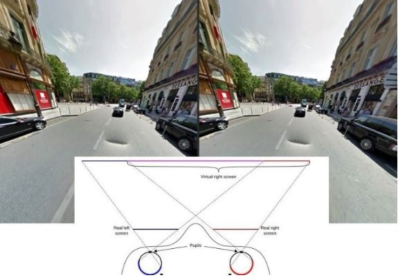
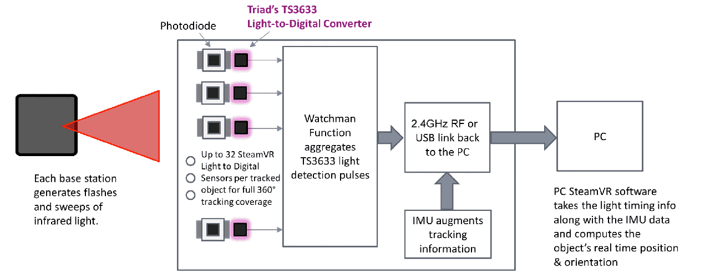

# VR 개발 원리

- 사람의 두 눈은 약 65mm(6.5cm)각격으로 배치되어 있다.
- 사람의 사야는 200정도의 화각 `FOV(Field of View)`를 볼수 있다.
- 사물을 바라볼 때 좌우눈에 다른 상이 광각을 가지고 망막에 결상되는데 이 광각을 뇌가 해석해서 입체를 느끼게 된다. 이렇게 형성된 미세한 좌우영상의 차이는 `시차(Parallax)`라고 부른다.

## 입체 영상의 구현종류
- 렌티큘러 : 기둥렌즈 필터를 이용하는 입체방식
- 레이저홀로그램 : 레이저를 이용한 홀로그램 인쇄기법에 의해 입체를 구성
- `스테레오스코픽(입체영상)` : 2장의 좌우 영상으로 입체를 구성하는 방식
    - 편광렌즈, LCK shutter Glasses, R-B Filter(anaglyph방식) 등

## VR의 한계
- 사람의 눈은 1만 7,250PPI(`Pixel Per Inch`)을 못 미친다.
- 영상이 전환되는 것 사이에 지연이 발생할 경우 `인지부조화`로 불편함을 느낄 수 있다. 
- 이상적으로 지연율은 5msec 이하여야 하
나 대부분의 VR 콘텐츠들은 20msec 정도로 그 간극이 크다

## 구글 카드보드
- 스마트폰 VR 환경은 `Side-by-Side(SBS)`방식
- 아크릴수지로 만든 볼록렌즈로 인해 휘어진 시야를 위한 어안렌더링을 하게 된다.
- `매직아이(Stereo Photo)`는 교차법과 평행법이 있는데, 구글 카드보드 형식은 `평행법`을 사용한다.
1. 보여지는 입체 대상물에 `양안시차`를 갖는 두 개의 영상이 포함되어야 함
2. 양안시차, 원근거리차, 폭주(convergence) 등이 포함되어 있어야한다.

## 360도 파노라마 뷰
1. 일반적인 구성 : Spherical Equirectangular `LatLong`(지구본 등)
    - 구 자체에 프로젝션 맵핑이 되는 원리
    - 2:1 규격 모바일4k VR기기3k
2. `화면스티칭(꿰메기)`를 하여 구성한다.
- 싼 기기는 두 개의 어안렌즈로 360도 동화상을 만들어낸다.
- AUTOPANO, Videostich 등의 제품이 있다.

## VR 코어기능
- Display
- Tracking
- Graphics Rendering
- Interaction
- Content
- H/W
- 이외 (Telepresence 등)

<br><br>
<br><br>
<br><br>


# SDK
## SDK란?
- `SDK` : 특정 플랫폼을 대상으로 소프트웨어 응용 프로그램을 개발하는 데 사용할 수 있는 프로그램, 샘플코드, 컴파일러나 에물레이터, 런타임, 디버깅 프로그램, 문서, API 등이 있다. 기술 참고 및 지원 문서를 지원한다.

- `API` : 운영체제가 응용프로그램을 위해 제공하는 `함수의 집합(모듈화)`으로, 응용프로그램과 디바이스를 연결해주는 역할을 한다. 앱을 개발하기 위해 운영체제나 프로그래밍언어가 제공하는 기능을 제어할 수 있게 만든 `인터페이스(규칙)`.

- `운영체`제 : 하드웨어와 응용프로그램 사이에 위치하며 응용 프로그램을 대신하여 하드웨어와 메모리를 관리하는 시스템 소프트웨어이다.

- `클래스 라이브러리` : 복잡하고 양이 많은 API함수들을 좀 더 쉽고 빠르게 사용하기 위해 클래스로 잘 포장하여 객체 위주로 프로그램을 작성하는 방법. ( 마이크로소프트 MFC)

- `마이그레이션` : 서비스 중인 한 어플리케이션 또는 모듈 등을 전혀 다른 환경(OS, 미들웨어, 하드웨어 등) 기존에 참조하던 라이브러리, API(함수) 등에 대해 동일한 역할을 하는 리눅스 기반의 그것으로 1:1 변환/매핑하는 작업. 소프트웨어나 하드웨어가 다른 환경에서 사용할 수 있게 변경되는 것에도 해당한다. 

- `plug-in` : Unity에서 Native(iOS, Android, Desktop)의 기능 또는 C/C++ 등으로 개발된 라이브러리를 연동 가능하게 한다.

- `Driver` : 컴퓨터와 연결된 특정장치와 통신하여 이를 제어하는 역할을 하는 프로그램. 어플리케이션 및 유저는 `운영체제`를 통해 드라이버의 기능을 사용하여 하드웨어 장치를 조정한다.

- `런타임` : 프로그래밍 언어가 구동되는 환경. 컴파일과정을 마친 응용프로그램이 동작되어지는 때를 런타임(Runtime)이라고 부른다.

- VR Best Practice(모범 실무) - Unity Learn : H/W, S/W에 대한 개발 Practice를 확실히 인지해야함
    - https://www.youtube.com/watch?v=sKQOlqNe_WY
    - https://www.youtube.com/watch?v=3gQym6mF2Jw
    - https://www.youtube.com/watch?v=KZwkRES04W0
    - https://www.youtube.com/watch?v=gh4k0Q1Pl7E&t=69s
    - https://www.youtube.com/watch?v=5C6zr4Q5AlA&t=124s
    - https://www.youtube.com/watch?v=53lwqmXCAXg


## SDK 역할
1. VR 컨트롤러의 상태를 체크하는 작업
2. VR 컨트롤러의 이벤트를 받아 처리하는 작업
3. C interface <-> Driver DLL <-> OVR Service <-> Rift HW

다음과 같은 기능을 지원한다.
- Correction of lens distortion
- Audio
- Head tracking
- 3D calibration
- Rendering
- Geometry configuration


## SDK 종류

| Device | Target Platfrom | VR SDK | Unity Package |
| :--- | :--- | :--- | :--- |
| HTC Vive | Standalone | OpenVR | StreamVR Plugin |
| Oculus Rift | Standalone | OpenVR | StreamVR Plugin |
| Oculus Rift | Standalone | Oculus | Oculus Integration |
| Windows IMR | Universal Window Platform | Window Mixed Reality | Mixed Reality Toolkit Unity |
| GearVR/GO | Android | Oculus | Oculus Integraion |
| Daydream | Android | Daydream | Google VR SDK for Unity and Daydream Elements |
| Cardboard | Adroid | Cardboard | Google VR SDK for Unity |
| Cardboard | iOS | Cardboard | Google VR SDK for Unity |


- `GoogleVR` : C 및 C ++의 기본 코드에 대한 API를 제공하는 NDK(Native Development Kit)

- `VIVEPORT SDK` : SteamVR 또는 HTC를 위한 구독서비스, VR 앱 스토어와 DRM, 인앱 구매, 리더 보드, 딥 링크 기능등을 지원한다.

- `VRTK 오픈소스 프레임워크` : VR 프로그램을 위한 편리한 스크립트 모음

- `OpenVR` : API 및 런타임 환경. 여러 VR 하드웨어와 application을 지원한다. 런타임은 SteamVR입니다.  컨텐츠가 VR 환경에서 장면을 렌더링 할 수 있도록 지원.

- `SteamVR` :  OpenVR의 런타임이며 HTC Vive를 포함한 다양한 VR 헤드셋에서 작동하는 `단일 인터페이스`이다. 컨트롤러, 모델에 액세스 할 수 있다.

- `Oculus SDK` : VR앱 구축을 돕는 다양한 엔진 별 Kit, Assets, Audio Package가 포함되어있다. Windows 용 Oculus PC SDK 및 Oculus Mobile SDK가 있습니다. 왜곡 및 렌더링 기술과 같은 많은 VR 컨텐츠 문제를 처리합니다.  Oculus Mobile SDK 에는 Oculus 및 Samsung Gear VR을위한 C / C ++ 개발을위한 도구와 라이브러리가 포함되어 있습니다.

## 참조
- sdk 종류 : https://thinkmobiles.com/blog/best-vr-sdk/
- 유니티 vr : https://docs.unity3d.com/kr/current/Manual/VROverview.html
- 구글 vr : https://developers.google.com/vr
- 스팀 vr : https://support.steampowered.com/kb_article.php?ref=1131-WSFG-3320&l=korean
- 구글 카드보드 : https://arvr.google.com/intl/ko_kr/cardboard/
- 참조 : https://unity.com/kr/solutions/ar-and-vr-games

<br><br>
<br><br>
<br><br>


# VR 최적화
기초적으로 해야할 것 :
- Enable static and dynamic batching.
- Disable shadow mapping.
- Disable procedural skybox and all skybox lighting.
- Disable runtime global illumination.
- Change all lights to baked.
- Change all emissive shader properties to baked.
- Size up your lightmap to 4096.
- Universal Render Pipeline 적용

이후 :
- Use the Profiler!
- Use CPU or GPU skinning.
- Inspect overdraw (scene view overdraw mode or replacement shader).
- Use the Frame Debugger to watch rendering order.
- Change render queues accordingly.

## CPU post-processing
- 스크립트/물리/AI 경량화
- Implement `LOD groups` : 게임 내 여러 오브젝트에 대해 각기 다른 mesh resolutions 할당
- `Occlusion culling` : 랜더링할 필요가 없는 오브젝트 살펴보기 (density of overdraw가 훨씬 낮아지고 랜더링되는 triangles과 batch의 수가 크게 달라진다. )
- `Dynamic batching` : batching이 필요하다면 Dynamic batching을 사용합니다. 씬에서 유사한 동적 오브젝트를 찾아 batch로 묶어서 사용되는 리소스를 줄일 수 있습니다. 
- `CPU skinning`
- `Frustrum culling` : 특정 순간에 frustrum에서 무엇이 렌더링되는지 확인
- `Set up the sorting` : 정렬 즉, 렌더링 순서 설정

## Render loop
- `Single Pass Stereo` 렌더링 활성화. : 각 눈을 따로 렌더링하는 대신 더 넓은 렌더 타겟과 교차 드로우콜을 사용하여 두 눈으로 보는 단일 씬을 한 번에 렌더링합니다.
- 그림자에 소요되는 리소스 줄이기 : 그림자를 드리우는 오브젝트와 그림자를 받는 오브젝트를 줄이고, shadow distance와 cascades를 제한하고, 가능하다면 그림자를 끕니다.
- `shadow mapping 지양` : Blob Shadow 또는 baked shadows사용. 각 오브젝트의 부모가 될 수 있는데 decals 사용.

## CPU to GPU
- `Batch` 사용 : 여러 작은 메시 대신 큰 메시 하나가 렌더링되도록 정적 오브젝트를 배칭합니다.
- `textures Atlasing` : 최대한 많은 textures와 materials을 texture atlases로 합쳐 렌더링 draw calls의 수를 줄입니다.
- 여러 작은 `lightmaps` 대신 더 적은 수의 큰 lightmaps을 구현합니다.
- Material property blocks, Enable Instancing 사용 : 머티리얼을 완전히 교체하는 대신 머터리얼의 특정 요소만 변경하여 instancing의 장점을 활용합니다.
- multithreaded rendering 사용하기.

## Vertex processing
- `Rasterization`
- `Use fewer triangles`
- 버텍스당 광원의 갯수를 줄임
- `GPU skinning` : GPU를 많이 사용하는 게임이라면 GPU 병목 현상을 일으키는 작업 중 이동 가능한 작업을 CPU에서 처리하도록 합니다.

## Fragment processing
- overdraw를 제한하여 성능 저하를 방지합니다. 오버레이되는 모든 요소(반투명한 연기 텍스처, 기타 파티클 효과, 겹쳐진 나뭇잎 등)을 줄인다.
- Material.renderQueue, Frame Debugger를 사용하여 렌더링 순서를 차례대로 확인하고 씬의 각 부분이 어느 단계에서 렌더링되는지 정확하게 파악합니다. 그런 다음, 렌더링 순서를 어떻게 변경할지 생각해보고 렌더링할 필요가 없는 요소를 찾을 수 있습니다.
- simplify their geometry
- Standard Shader 보다 mobile specular shader나 기타 최적화된 모바일 셰이더를 대신 사용할 수도 있습니다.

## Multipass
- Forward lighting light pass
- Decrease per pixel light range.
- Set a Maximum number of per pixel lights.
- 광원을 일정한 간격으로 배치하여 overlapping을 방지하면 필요한 리소스가 절약됩니다.

## 화면 공간 프로세싱
가장 많이 사용되는 `포스트 프로세싱` 효과를 리소스를 적게 사용하는 순
- 색보정 < 톤매핑 < 블룸 < AA < SSRR:화면공간반사 < SSAO:화면공간엠비언트오클루전

## 참조
VR 최적화 : https://unity3d.com/kr/how-to/optimize-mobile-VR-games

<br><br>
<br><br>
<br><br>


# How is a HeadTracking works?
## 기술 

- 360도 헤드 트래킹(현실 공간처럼 머리를 상하좌우로 돌릴 때마다 다른 장면이 나타나는 기술)
- 사용자 위치 파악 기술(Positional Tracking)
- 사용자 위치에 따른 소리 구현 기술(Positional Sound)
- `트래킹 시스템` : 적외선 레이저가 내장된 베이스 스테이션이 실내 공간을 수직과 수평으로 스캔하면 물체에 탑재된 센서가 이 레이저를 감지해 PC로 정보를 보내고 호스트 PC는 이를 토대로 시차에 따른 위치를 계산하는 식이다.

## 센서
- `자이로센서` : 기울어져 있는 각도를 측정해 상하좌우의 움직임을 감지한다.
- `가속도센서` : 자이로 센서와 결합해 움직임을 잡아낸다. (칼만필터, 적분을 활용하여 위치를 감지)
- `지자계 센서` : 자기장의 강약을 감지하며 자이로 센서를 보완하는 역할을 한다.
 하이 엔드 헤드셋은 적외선 LED, 카메라 및 자력계를 포함한 다른 시스템과 함께 정밀 센서로보다 정확한 추적 기능을 제공 합니다.

## 참조
- 트래킹 시스템: http://virtualworld.co.kr/article/1348?force=1

<br><br>
<br><br>
<br><br>


# 아두이노 활용
- 센서 및 블루투스모듈(HC-06) 활용
- 아두니티, Uniduino 플러그인 등을 활용

## 룸스케일 트래킹 구현
`룸스케일`이란 방(room) 안에서 자유롭게 트래킹하는 것을 말합니다. 
 일단 두 개 이상의 고정된 적외선 카메라와 `자이로스코프 센서를 이용하여 트래킹`을 합니다. 자이로스코프 센서가 실시간 트래킹을 맡으며 `적외선카메라는 기기의 초기좌표 매핑과 자이로 센서 트래킹의 오차를 수정하는 역할을 합니다.` 
`적외선카메라는 일반 카메라에 가시광선 차단 필터를 씌운 것으로 hmd와 컨트롤러에 부착된 적외선 led에서 나오는 빛을 추적합니다.` 각각 다른 시점에서 촬영된 이미지 상에서 표시된 적외선의 좌표를 이용해 각 led의 절대 좌표를 구하고 이를 통해 자이로 센서에서 발생한 오차를 수정하는 데 사용합니다.  

- MPU6050로 트랙킹 구현 : https://diy-project.tistory.com/12

## 코드 작성하기
시리얼 모니터 설정하기
- AT : 에코명령으로 정상적인 연결상태일 경우 OK를 반환
- AT+NAME(input_name) : 블루투스의 이름을 명명
- AT+PIN(input_pin) : 블루투스 연결 시 비밀번호를 설정한다.
- AT+BAUD4 : 아두이노와 블루투스가 통신할 속도를 설정 (4는 9600)
```c++
// Unity와 연동할 코드
// 블루투스 2.0(HC-06)
#include <SoftwareSerial.h> // 시리얼 포트 생성관련 클래스

// 블루투스 연동을 위한 소프트웨어 시리얼 구현
SoftwareSerial BTSerial(2, 3);  // Bluetooth's TX, RX
 
int firePin = 6;
int cancelPin = 7;
 
int lastB1 = HIGH;
int lastB2 = HIGH;
 
unsigned long lastSendTime = 0;
unsigned long RESEND_THRESHOLD = 200;
 
void setup() { // 시리얼 통신 configuration
  pinMode(firePin, INPUT_PULLUP);
  pinMode(cancelPin, INPUT_PULLUP);
  BTSerial.begin(9600); // 시리얼 통신 속도
}
 
void loop() { // 데이터 통신
  int curB1 = digitalRead(firePin);
  int curB2 = digitalRead(cancelPin);
  
  unsigned long curTime = millis();
  if(BTSerial.available()){ // 블루투스 모듈에 데이터가 왔을 경우
    if(curTime > lastSendTime + RESEND_THRESHOLD) {
        if(curB1 == LOW) {
        BTSerial.write('b');
        lastSendTime = curTime;      
        } else if(curB2 == LOW) {
        BTSerial.write('c');
        lastSendTime = curTime;      
        }
    }
  }
  
  lastB1 = curB1;
  lastB2 = curB2;
}
```
```c#
// 블루투스 Unity Package 설치
// 블루투스 켜기 -> 기기 찾아서 장치추가하기
using UnityEngine;
using System.Collections;

public class BTBasicScript : MonoBehaviour
{
    string fromArduino = "" ;
    void Start ()
    {
        BtConnector.moduleName ("SPL V3 B0015");
        BtConnector.connect();
    }

    void Update()
    {
        if (Input.GetKeyDown(KeyCode.Escape))
        {
            BtConnector.close();
        }
        if (BtConnector.isConnected() && BtConnector.available())
        {
            fromArduino = BtConnector.readLine();
            if (fromArduino.StartsWith("<") && fromArduino.EndsWith(">"))
            {
                // 입력
            }
        }
    }

    void OnGUI()
    {
        GUI.Label(new Rect(0, 20, Screen.width, Screen.height*0.1f),"Arduino : " + fromArduino);
        GUI.Label(new Rect(Screen.width * 0.5f, 20, Screen.width, Screen.height * 0.1f), “Status : " + BtConnector.readControlData());
    }
}
```
